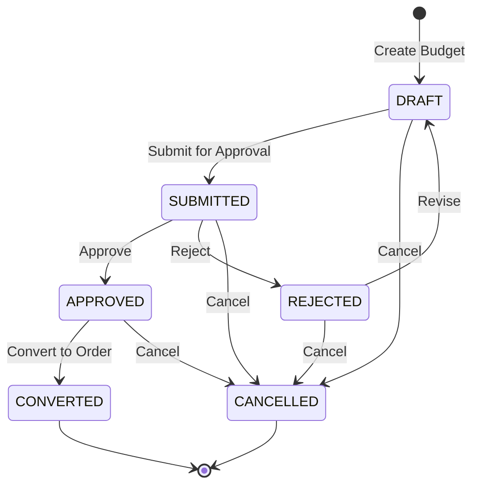

# Budget System - Comprehensive Correction and Migration Guide

**Document Version:** 1.0  
**Date:** 2025-01-06  
**Analysis Scope:** Legacy System (ED/) vs Modern System (alphabook_web/)

---

## Executive Summary

This document provides a comprehensive analysis of missing features and functionality gaps between the legacy budget creation system in [`ED/consultar_orcamento.py`](../ED/consultar_orcamento.py) and the current React-based implementation in [`alphabook_web/`](../alphabook_web/). 

**Critical Finding:** The modern budget form is missing **8 essential dropdown fields** for product specifications that were fully implemented in the legacy system. These fields are crucial for complete budget creation and must be restored.

---

## Table of Contents

1. [Database Schema Comparison](#1-database-schema-comparison)
2. [Missing Form Fields Inventory](#2-missing-form-fields-inventory)
3. [Dropdown Options & Enumerated Values](#3-dropdown-options--enumerated-values)
4. [Business Rules Documentation](#4-business-rules-documentation)
5. [Integration Points](#5-integration-points)
6. [Technical Implementation Guide](#6-technical-implementation-guide)
7. [Priority Rankings](#7-priority-rankings)
8. [Backward Compatibility Strategy](#8-backward-compatibility-strategy)

---

## 1. Database Schema Comparison

### 1.1 Legacy Database Schema (SQLite)

**Source:** [`ED/banco.py`](../ED/banco.py:10-40)

```sql
CREATE TABLE IF NOT EXISTS orcamentos (
    id INTEGER PRIMARY KEY AUTOINCREMENT,
    numero_pedido TEXT,
    data_pedido TEXT,
    data_entrega TEXT,
    solicitante TEXT,
    documento TEXT,
    editorial TEXT,
    tipo_produto TEXT,
    titulo TEXT,
    tiragem TEXT,
    formato TEXT,
    total_pgs TEXT,
    pgs_colors TEXT,
    cor_miolo TEXT,           -- ❌ MISSING IN FORM
    papel_miolo TEXT,         -- ❌ MISSING IN FORM
    papel_capa TEXT,          -- ❌ MISSING IN FORM
    cor_capa TEXT,            -- ❌ MISSING IN FORM
    laminacao TEXT,           -- ❌ MISSING IN FORM
    acabamento TEXT,          -- ❌ MISSING IN FORM
    shrink TEXT,              -- ❌ MISSING IN FORM
    centro_producao TEXT,     -- ❌ MISSING IN FORM
    observacoes TEXT,
    preco_unitario TEXT,
    preco_total TEXT,
    prazo_producao TEXT,
    pagamento TEXT,
    frete TEXT
)
```

### 1.2 Modern Database Schema (PostgreSQL via Prisma)

**Source:** [`alphabook_web/prisma/schema.prisma`](../alphabook_web/prisma/schema.prisma:127-185)

```prisma
model Budget {
  id                  Int          @id @default(autoincrement())
  clientId            Int?
  centerId            Int?
  status              BudgetStatus @default(DRAFT)
  
  // Core fields
  numero_pedido       String?
  data_pedido         DateTime     @default(now())
  data_entrega        DateTime?
  solicitante         String?
  documento           String?
  editorial           String?
  tipo_produto        String?
  titulo              String
  tiragem             Int
  formato             String
  total_pgs           Int
  pgs_colors          Int
  cor_miolo           String?      // ✅ EXISTS IN SCHEMA
  papel_miolo         String?      // ✅ EXISTS IN SCHEMA
  papel_capa          String?      // ✅ EXISTS IN SCHEMA
  cor_capa            String?      // ✅ EXISTS IN SCHEMA
  laminacao           String?      // ✅ EXISTS IN SCHEMA
  acabamento          String?      // ✅ EXISTS IN SCHEMA
  shrink              String?      // ✅ EXISTS IN SCHEMA
  centro_producao     String?      // ✅ EXISTS IN SCHEMA
  observacoes         String?
  preco_unitario      Float
  preco_total         Float
  prazo_producao      String?
  pagamento           String?
  frete               String?
  
  // Audit trail fields (NEW - not in legacy)
  submittedAt         DateTime?
  approvedAt          DateTime?
  rejectedAt          DateTime?
  cancelledAt         DateTime?
  convertedAt         DateTime?
  approvedById        Int?
  rejectedById        Int?
  approved            Boolean      @default(false)
  
  // Relationships
  client              Client?      @relation(fields: [clientId], references: [id])
  center              Center?      @relation(fields: [centerId], references: [id])
  order               Order?
  approvedBy          User?        @relation("BudgetApprovedBy", fields: [approvedById], references: [id])
  rejectedBy          User?        @relation("BudgetRejectedBy", fields: [rejectedById], references: [id])
}
```

**Schema Status:** ✅ **ALL columns exist in database** - The issue is in the React form, not the database!

---

## 2. Missing Form Fields Inventory

### 2.1 Critical Missing Dropdown Fields

**Current Status:** The modern budget form at [`alphabook_web/src/components/forms/budget-form.tsx`](../alphabook_web/src/components/forms/budget-form.tsx) is missing **8 critical specification fields** that exist in both the legacy form and the modern database schema.

| Field Name | Legacy Form | Modern DB Schema | Modern Form | Priority | Business Impact |
|------------|-------------|------------------|-------------|----------|-----------------|
| `cor_miolo` | ✅ Dropdown | ✅ String? | ❌ **MISSING** | **P0** | **CRITICAL** - Cannot specify interior color |
| `papel_miolo` | ✅ Dropdown | ✅ String? | ❌ **MISSING** | **P0** | **CRITICAL** - Cannot specify interior paper type |
| `papel_capa` | ✅ Dropdown | ✅ String? | ❌ **MISSING** | **P0** | **CRITICAL** - Cannot specify cover paper type |
| `cor_capa` | ✅ Dropdown | ✅ String? | ❌ **MISSING** | **P0** | **CRITICAL** - Cannot specify cover color |
| `laminacao` | ✅ Dropdown | ✅ String? | ❌ **MISSING** | **P0** | **CRITICAL** - Cannot specify lamination type |
| `acabamento` | ✅ Dropdown | ✅ String? | ❌ **MISSING** | **P0** | **CRITICAL** - Cannot specify finishing type |
| `shrink` | ✅ Dropdown | ✅ String? | ❌ **MISSING** | **P1** | **HIGH** - Cannot specify shrink wrap |
| `centro_producao` | ✅ Dropdown | ✅ String? | ❌ **MISSING** | **P1** | **HIGH** - Cannot specify production center |
| `frete` | ✅ Text Input | ✅ String? | ❌ **MISSING** | **P2** | **MEDIUM** - Cannot specify shipping details |

### 2.2 Form Location Analysis

**Missing Fields Location in Form:**

The legacy system had these fields in a dedicated "Especificações de Produção" (Production Specifications) section. The modern form at [`budget-form.tsx:419-687`](../alphabook_web/src/components/forms/budget-form.tsx:419-687) needs a new section between "Basic Specifications" and "Business Terms".

**Recommended Form Section Structure:**

```
1. Client and Production Center Selection (EXISTS)
2. Project Identification (EXISTS)
3. Basic Specifications (EXISTS)
4. ⚠️ PRODUCTION SPECIFICATIONS (MISSING - ADD THIS SECTION)
   - Paper specifications (papel_miolo, papel_capa)
   - Color specifications (cor_miolo, cor_capa)
   - Finishing specifications (laminacao, acabamento, shrink)
   - Production center (centro_producao)
5. Business Terms (EXISTS)
6. Timeline (EXISTS)
7. Additional Information (EXISTS - includes frete field)
```

---

## 3. Dropdown Options & Enumerated Values

### 3.1 Complete Specifications from Legacy System

**Source:** [`ED/especificacoes.json`](../ED/especificacoes.json)

#### 3.1.1 Tipo de Papel de Miolo (Interior Paper Type)

```json
{
  "Tipo de Papel miolo": [
    "offset 75g",
    "offset 90g",
    "pólen Soft Nat 80g",
    "pólen Bold 90g",
    "pólen Bold 70g",
    "couchê 90g",
    "couchê 115g",
    "couchê 150g",
    "Avena 70g",
    "Avena 80g",
    "off set 120g"
  ]
}
```

**TypeScript Interface:**
```typescript
type PapelMioloOption = 
  | "offset 75g"
  | "offset 90g"
  | "pólen Soft Nat 80g"
  | "pólen Bold 90g"
  | "pólen Bold 70g"
  | "couchê 90g"
  | "couchê 115g"
  | "couchê 150g"
  | "Avena 70g"
  | "Avena 80g"
  | "off set 120g";
```

#### 3.1.2 Tipo de Papel de Capa (Cover Paper Type)

```json
{
  "Tipo de Papel de Capa": [
    "Cartão Sup. Triplex 250g",
    "Cartão Sup. Triplex 300g",
    "Couchê 150g",
    "Couchê 170g",
    "Cartão DuoDesing 300g"
  ]
}
```

**TypeScript Interface:**
```typescript
type PapelCapaOption = 
  | "Cartão Sup. Triplex 250g"
  | "Cartão Sup. Triplex 300g"
  | "Couchê 150g"
  | "Couchê 170g"
  | "Cartão DuoDesing 300g";
```

#### 3.1.3 Cor do Miolo (Interior Color)

```json
{
  "Cor do miolo": [
    "4/0",  // 4 cores frente / 0 cores verso
    "4/4",  // 4 cores frente / 4 cores verso
    "1/0",  // 1 cor frente / 0 cores verso (preto e branco)
    "1/1"   // 1 cor frente / 1 cor verso
  ]
}
```

**Color Code Explanation:**
- `4/0`: Full color front, no color back
- `4/4`: Full color both sides (CMYK)
- `1/0`: Single color front (typically black), no color back
- `1/1`: Single color both sides

**TypeScript Interface:**
```typescript
type CorMioloOption = "4/0" | "4/4" | "1/0" | "1/1";
```

#### 3.1.4 Cor da Capa (Cover Color)

```json
{
  "Cor da capa": [
    "4/0",        // 4 cores frente / 0 cores verso
    "4/4",        // 4 cores frente / 4 cores verso
    "Sem capa",   // No cover
    "Fichário"    // Binder/folder format
  ]
}
```

**TypeScript Interface:**
```typescript
type CorCapaOption = "4/0" | "4/4" | "Sem capa" | "Fichário";
```

#### 3.1.5 Tipo de Laminação (Lamination Type)

```json
{
  "Tipo de laminação": [
    "Brilho",              // Glossy lamination
    "Fosca",               // Matte lamination
    "Verniz Localizado"    // Spot UV coating
  ]
}
```

**TypeScript Interface:**
```typescript
type LaminacaoOption = "Brilho" | "Fosca" | "Verniz Localizado";
```

#### 3.1.6 Tipo de Acabamento (Finishing Type)

```json
{
  "Tipo de acabamento": [
    "Lombada colada",       // Perfect binding
    "Grampo e dobra",       // Saddle stitch
    "wire-o",               // Wire-o binding
    "espiral",              // Spiral binding
    "espiral + Acetato",    // Spiral binding with acetate cover
    "Costurado e colado",   // Sewn and glued
    "Capa Dura",            // Hardcover
    "corte reto",           // Straight cut
    "sem acabamento"        // No finishing
  ]
}
```

**TypeScript Interface:**
```typescript
type AcabamentoOption = 
  | "Lombada colada"
  | "Grampo e dobra"
  | "wire-o"
  | "espiral"
  | "espiral + Acetato"
  | "Costurado e colado"
  | "Capa Dura"
  | "corte reto"
  | "sem acabamento";
```

#### 3.1.7 Shrink (Shrink Wrap)

```json
{
  "Shrink": [
    "sim",  // Yes
    "não"   // No
  ]
}
```

**TypeScript Interface:**
```typescript
type ShrinkOption = "sim" | "não";
```

#### 3.1.8 Centro de Produção (Production Center)

```json
{
  "Centro de Produção": [
    "2Print",
    "Dataprint BR One",
    "JMV"
  ]
}
```

**TypeScript Interface:**
```typescript
type CentroProducaoOption = "2Print" | "Dataprint BR One" | "JMV";
```

**Note:** In the modern system, this should ideally be fetched from the [`Center`](../alphabook_web/prisma/schema.prisma:61-76) table via API rather than hardcoded.

### 3.2 Data Storage Recommendations

#### Option 1: Enum Tables (Recommended for Production)

Create dedicated enum tables in PostgreSQL for better data integrity:

```sql
-- Migration: Add enum tables for budget specifications
CREATE TABLE papel_miolo_options (
  id SERIAL PRIMARY KEY,
  value VARCHAR(50) UNIQUE NOT NULL,
  display_label VARCHAR(50) NOT NULL,
  weight_grams INTEGER,
  active BOOLEAN DEFAULT TRUE,
  created_at TIMESTAMP DEFAULT NOW()
);

CREATE TABLE papel_capa_options (
  id SERIAL PRIMARY KEY,
  value VARCHAR(50) UNIQUE NOT NULL,
  display_label VARCHAR(50) NOT NULL,
  weight_grams INTEGER,
  active BOOLEAN DEFAULT TRUE,
  created_at TIMESTAMP DEFAULT NOW()
);

-- Similar tables for other enum types
```

**Prisma Schema Addition:**
```prisma
model PapelMioloOption {
  id            Int      @id @default(autoincrement())
  value         String   @unique
  displayLabel  String
  weightGrams   Int?
  active        Boolean  @default(true)
  createdAt     DateTime @default(now())
  
  @@map("papel_miolo_options")
}

model PapelCapaOption {
  id            Int      @id @default(autoincrement())
  value         String   @unique
  displayLabel  String
  weightGrams   Int?
  active        Boolean  @default(true)
  createdAt     DateTime @default(now())
  
  @@map("papel_capa_options")
}
```

**API Endpoint:**
```typescript
// GET /api/specifications/papel-miolo
export async function GET() {
  const options = await prisma.papelMioloOption.findMany({
    where: { active: true },
    orderBy: { displayLabel: 'asc' }
  });
  return NextResponse.json({ data: options });
}
```

#### Option 2: JSON Configuration (Current Approach)

The current system uses [`especificacoes.json`](../alphabook_web/src/lib/especificacoes.json) which mirrors the legacy system. This is simpler but less flexible.

**Current API:** [`/api/specifications`](../alphabook_web/src/app/api/specifications/route.ts)

#### Option 3: TypeScript Enums (Type Safety Only)

For immediate implementation, use TypeScript enums with validation:

```typescript
// src/lib/specifications-enums.ts
export const PAPEL_MIOLO_OPTIONS = [
  "offset 75g",
  "offset 90g",
  "pólen Soft Nat 80g",
  "pólen Bold 90g",
  "pólen Bold 70g",
  "couchê 90g",
  "couchê 115g",
  "couchê 150g",
  "Avena 70g",
  "Avena 80g",
  "off set 120g"
] as const;

export type PapelMioloOption = typeof PAPEL_MIOLO_OPTIONS[number];

// Zod validation
export const PapelMioloSchema = z.enum(PAPEL_MIOLO_OPTIONS);
```

---

## 4. Business Rules Documentation

### 4.1 Budget Workflow State Machine

**Source:** Inferred from [`ED/consultar_orcamento.py`](../ED/consultar_orcamento.py:47-165) and modern API endpoints



### 4.2 Budget Creation Rules

**From Legacy System Analysis:**

1. **Automatic Number Generation:**
   - Legacy: [`ED/banco.py:99-108`](../ED/banco.py:99-108)
   - Modern: [`alphabook_web/src/lib/order-number.ts`](../alphabook_web/src/lib/order-number.ts)
   - Format: `0001/YYYYMM` (e.g., `0001/202501`)
   - Sequential within month
   - Auto-generated on save

2. **Required Fields:**
   - `titulo` (Title) - **Required**
   - `tiragem` (Print Run) - **Required, Integer > 0**
   - `formato` (Format) - **Required**
   - `total_pgs` (Total Pages) - **Required, Integer >= 0**
   - `pgs_colors` (Color Pages) - **Required, Integer >= 0**
   - `preco_unitario` (Unit Price) - **Required, Number >= 0**
   - `clientId` - **Required** (via relationsh

ip)
   - `centerId` - **Required** (via relationship)

3. **Calculated Fields:**
   - `preco_total` = `tiragem` × `preco_unitario`
   - Auto-calculated in real-time on form
   - Implementation: [`budget-form.tsx:128-133`](../alphabook_web/src/components/forms/budget-form.tsx:128-133)

4. **Optional Fields:**
   - All specification dropdowns (cor_miolo, papel_miolo, etc.)
   - Dates (data_pedido defaults to now, data_entrega optional)
   - All text fields (solicitante, documento, editorial, observacoes, frete)

### 4.3 Budget Approval Workflow

**Implemented in Modern System:**

1. **Submit for Approval:** [`/api/budgets/[id]/submit`](../alphabook_web/src/app/api/budgets/[id]/submit/route.ts)
   - Only DRAFT budgets can be submitted
   - Requires MODERATOR or ADMIN role
   - Sets `status` to SUBMITTED
   - Records `submittedAt` timestamp

2. **Approve Budget:** [`/api/budgets/[id]/approve`](../alphabook_web/src/app/api/budgets/[id]/approve/route.ts)
   - Only SUBMITTED budgets can be approved
   - Requires MODERATOR or ADMIN role
   - Sets `status` to APPROVED
   - Records `approvedAt` timestamp and `approvedById`
   - Sets legacy `approved` field to `true`

3. **Reject Budget:** [`/api/budgets/[id]/reject`](../alphabook_web/src/app/api/budgets/[id]/reject/route.ts)
   - Only SUBMITTED budgets can be rejected
   - Requires MODERATOR or ADMIN role
   - Sets `status` to REJECTED
   - Records `rejectedAt` timestamp and `rejectedById`
   - Appends rejection reason to `observacoes`

4. **Convert to Order:** [`/api/budgets/[id]/convert-to-order`](../alphabook_web/src/app/api/budgets/[id]/convert-to-order/route.ts)
   - Only APPROVED budgets can be converted
   - Requires MODERATOR or ADMIN role
   - Creates new Order with `orderType: 'BUDGET_DERIVED'`
   - Copies all relevant fields from budget to order
   - Sets budget `status` to CONVERTED
   - Records `convertedAt` timestamp
   - Excludes `preco_unitario` and `preco_total` from order (per legacy line 148)

### 4.4 Legacy vs Modern Workflow Differences

| Feature | Legacy System | Modern System | Gap Analysis |
|---------|---------------|---------------|--------------|
| Budget States | Implicit (no status field) | Explicit 6-state enum | ✅ **ENHANCED** |
| Approval Tracking | Boolean `approved` | Full audit trail | ✅ **ENHANCED** |
| User Tracking | None | `approvedById`, `rejectedById` | ✅ **ENHANCED** |
| Timestamps | Only `data_pedido` | Full lifecycle timestamps | ✅ **ENHANCED** |
| Rejection Reasons | None | Appended to observacoes | ✅ **ENHANCED** |
| Query/Search | Simple SELECT | Filtered queries with pagination | ✅ **ENHANCED** |

---

## 5. Integration Points

### 5.1 Legacy System Integration

**Budget Query System:** [`ED/consultar_orcamento.py`](../ED/consultar_orcamento.py)

Key Integration Points:

1. **Budget Listing:**
   - Legacy: [`consultar_orcamento.py:47-50`](../ED/consultar_orcamento.py:47-50)
   ```python
   cursor.execute("SELECT numero_pedido, titulo, solicitante FROM orcamentos")
   ```
   - Modern: [`/api/budgets`](../alphabook_web/src/app/api/budgets/route.ts:64-69) with pagination

2. **Budget Details View:**
   - Legacy: [`consultar_orcamento.py:71`](../ED/consultar_orcamento.py:71)
   ```python
   cursor.execute("SELECT * FROM orcamentos WHERE numero_pedido = ?")
   ```
   - Modern: [`/api/budgets/[id]`](../alphabook_web/src/app/api/budgets/[id]/route.ts:21-28)

3. **Create Production Order from Budget:**
   - Legacy: [`consultar_orcamento.py:148-151`](../ED/consultar_orcamento.py:148-151)
   ```python
   # Line 148: Remove price fields
   dados_ordem.pop('preco_unitario', None)
   dados_ordem.pop('preco_total', None)
   # Line 151: Save and open production order screen
   ```
   - Modern: [`/api/budgets/[id]/convert-to-order`](../alphabook_web/src/app/api/budgets/[id]/convert-to-order/route.ts:95-132)

### 5.2 External System Integration Points

**None Identified** - The legacy system is self-contained with no external API integrations.

**Future Integration Opportunities:**
- ERP system integration for pricing
- Inventory management for paper stock
- Production management system
- Shipping/logistics system

---

## 6. Technical Implementation Guide

### 6.1 React Form Component Updates

**Target File:** [`alphabook_web/src/components/forms/budget-form.tsx`](../alphabook_web/src/components/forms/budget-form.tsx)

#### Step 1: Add New Section After Line 578

Insert new "Production Specifications" section between "Basic Specifications" and "Business Terms":

```tsx
{/* Section 4: Production Specifications */}
<div className="space-y-4">
  <h3 className="text-lg font-semibold text-gray-900 border-b pb-2">
    Especificações de Produção
  </h3>
  
  {/* Row 1: Paper Types */}
  <FormGrid columns={2} gap="md">
    <FormField>
      <Label htmlFor="papel_miolo">Tipo de Papel do Miolo</Label>
      {specifications?.["Tipo de Papel miolo"] ? (
        <Select 
          onValueChange={(value) => setValue('papel_miolo', value)} 
          defaultValue={initialData?.papel_miolo || undefined}
          disabled={!canEdit}
        >
          <SelectTrigger>
            <SelectValue placeholder="Selecione..." />
          </SelectTrigger>
          <SelectContent>
            {specifications["Tipo de Papel miolo"].map((item: string) => (
              <SelectItem key={item} value={item}>{item}</SelectItem>
            ))}
          </SelectContent>
        </Select>
      ) : (
        <Input 
          id="papel_miolo" 
          placeholder="Tipo de papel do miolo" 
          disabled={!canEdit}
          {...register('papel_miolo')} 
        />
      )}
    </FormField>

    <FormField>
      <Label htmlFor="papel_capa">Tipo de Papel da Capa</Label>
      {specifications?.["Tipo de Papel de Capa"] ? (
        <Select 
          onValueChange={(value) => setValue('papel_capa', value)} 
          defaultValue={initialData?.papel_capa || undefined}
          disabled={!canEdit}
        >
          <SelectTrigger>
            <SelectValue placeholder="Selecione..." />
          </SelectTrigger>
          <SelectContent>
            {specifications["Tipo de Papel de Capa"].map((item: string) => (
              <SelectItem key={item} value={item}>{item}</SelectItem>
            ))}
          </SelectContent>
        </Select>
      ) : (
        <Input 
          id="papel_capa" 
          placeholder="Tipo de papel da capa" 
          disabled={!canEdit}
          {...register('papel_capa')} 
        />
      )}
    </FormField>
  </FormGrid>

  {/* Row 2: Colors */}
  <FormGrid columns={2} gap="md">
    <FormField>
      <Label htmlFor="cor_miolo">Cor do Miolo</Label>
      {specifications?.["Cor do miolo"] ? (
        <Select 
          onValueChange={(value) => setValue('cor_miolo', value)} 
          defaultValue={initialData?.cor_miolo || undefined}
          disabled={!canEdit}
        >
          <SelectTrigger>
            <SelectValue placeholder="Selecione..." />
          </SelectTrigger>
          <SelectContent>
            {specifications["Cor do miolo"].map((item: string) => (
              <SelectItem key={item} value={item}>{item}</SelectItem>
            ))}
          </SelectContent>
        </Select>
      ) : (
        <Input 
          id="cor_miolo" 
          placeholder="Cor do miolo" 
          disabled={!canEdit}
          {...register('cor_miolo')} 
        />
      )}
    </FormField>

    <FormField>
      <Label htmlFor="cor_capa">Cor da Capa</Label>
      {specifications?.["Cor da capa"] ? (
        <Select 
          onValueChange={(value) => setValue('cor_capa', value)} 
          defaultValue={initialData?.cor_capa || undefined}
          disabled={!canEdit}
        >
          <SelectTrigger>
            <SelectValue placeholder="Selecione..." />
          </SelectTrigger>
          <SelectContent>
            {specifications["Cor da capa"].map((item: string) => (
              <SelectItem key={item} value={item}>{item}</SelectItem>
            ))}
          </SelectContent>
        </Select>
      ) : (
        <Input 
          id="cor_capa" 
          placeholder="Cor da capa" 
          disabled={!canEdit}
          {...register('cor_capa')} 
        />
      )}
    </FormField>
  </FormGrid>

  {/* Row 3: Finishing */}
  <FormGrid columns={3} gap="md">
    <FormField>
      <Label htmlFor="laminacao">Laminação</Label>
      {specifications?.["Tipo de laminação"] ? (
        <Select 
          onValueChange={(value) => setValue('laminacao', value)} 
          defaultValue={initialData?.laminacao || undefined}
          disabled={!canEdit}
        >
          <SelectTrigger>
            <SelectValue placeholder="Selecione..." />
          </SelectTrigger>
          <SelectContent>
            {specifications["Tipo de laminação"].map((item: string) => (
              <SelectItem key={item} value={item}>{item}</SelectItem>
            ))}
          </SelectContent>
        </Select>
      ) : (
        <Input 
          id="laminacao" 
          placeholder="Tipo de laminação" 
          disabled={!canEdit}
          {...register('laminacao')} 
        />
      )}
    </FormField>

    <FormField>
      <Label htmlFor="acabamento">Acabamento</Label>
      {specifications?.["Tipo de acabamento"] ? (
        <Select 
          onValueChange={(value) => setValue('acabamento', value)} 
          defaultValue={initialData?.acabamento || undefined}
          disabled={!canEdit}
        >
          <SelectTrigger>
            <SelectValue placeholder="Selecione..." />
          </SelectTrigger>
          <SelectContent>
            {specifications["Tipo de acabamento"].map((item: string) => (
              <SelectItem key={item} value={item}>{item}</SelectItem>
            ))}
          </SelectContent>
        </Select>
      ) : (
        <Input 
          id="acabamento" 
          placeholder="Tipo de acabamento" 
          disabled={!canEdit}
          {...register('acabamento')} 
        />
      )}
    </FormField>

    <FormField>
      <Label htmlFor="shrink">Shrink</Label>
      {specifications?.["Shrink"] ? (
        <Select
          onValueChange={(value) => setValue('shrink', value)}
          defaultValue={initialData?.shrink || undefined}
          disabled={!canEdit}
        >
          <SelectTrigger>
            <SelectValue placeholder="Selecione..." />
          </SelectTrigger>
          <SelectContent>
            {specifications["Shrink"].map((item: string) => (
              <SelectItem key={item} value={item}>{item}</SelectItem>
            ))}
          </SelectContent>
        </Select>
      ) : (
        <Input
          id="shrink"
          placeholder="Shrink"
          disabled={!canEdit}
          {...register('shrink')}
        />
      )}
    </FormField>
  </FormGrid>

  {/* Row 4: Production Center */}
  <FormGrid columns={1} gap="md">
    <FormField>
      <Label htmlFor="centro_producao">Centro de Produção</Label>
      {specifications?.["Centro de Produção"] ? (
        <Select
          onValueChange={(value) => setValue('centro_producao', value)}
          defaultValue={initialData?.centro_producao || undefined}
          disabled={!canEdit}
        >
          <SelectTrigger>
            <SelectValue placeholder="Selecione..." />
          </SelectTrigger>
          <SelectContent>
            {specifications["Centro de Produção"].map((item: string) => (
              <SelectItem key={item} value={item}>{item}</SelectItem>
            ))}
          </SelectContent>
        </Select>
      ) : (
        <Input
          id="centro_producao"
          placeholder="Centro de produção"
          disabled={!canEdit}
          {...register('centro_producao')}
        />
      )}
    </FormField>
  </FormGrid>
</div>
```

#### Step 2: Update Form Validation Schema

**File:** [`alphabook_web/src/lib/validations/budget.ts`](../alphabook_web/src/lib/validations/budget.ts)

```typescript
// Add to existing BudgetSchema
export const BudgetSchema = z.object({
  // ... existing fields ...

  // New specification fields
  cor_miolo: z.string().optional(),
  papel_miolo: z.string().optional(),
  papel_capa: z.string().optional(),
  cor_capa: z.string().optional(),
  laminacao: z.string().optional(),
  acabamento: z.string().optional(),
  shrink: z.string().optional(),
  centro_producao: z.string().optional(),

  // ... existing fields ...
});
```

#### Step 3: Update API Endpoints

**File:** [`alphabook_web/src/app/api/budgets/route.ts`](../alphabook_web/src/app/api/budgets/route.ts)

```typescript
// Update POST endpoint to handle new fields
export async function POST(request: NextRequest) {
  try {
    const json = await request.json();
    const data = BudgetSchema.parse(json);

    const budget = await prisma.budget.create({
      data: {
        ...data,
        // Include new specification fields
        cor_miolo: data.cor_miolo,
        papel_miolo: data.papel_miolo,
        papel_capa: data.papel_capa,
        cor_capa: data.cor_capa,
        laminacao: data.laminacao,
        acabamento: data.acabamento,
        shrink: data.shrink,
        centro_producao: data.centro_producao,
      },
    });

    return NextResponse.json({ data: budget });
  } catch (error) {
    // ... error handling
  }
}
```

---

## 7. Priority Rankings

### 7.1 Implementation Priority Matrix

| Priority | Feature | Business Impact | Implementation Complexity | Dependencies |
|----------|---------|-----------------|--------------------------|--------------|
| **P0-CRITICAL** | Production Specification Dropdowns | **CRITICAL** - Cannot create complete budgets | **LOW** - Form fields only | Specifications API |
| **P0-CRITICAL** | Paper Type Fields (papel_miolo, papel_capa) | **CRITICAL** - Essential for production | **LOW** - Dropdowns | Specifications API |
| **P0-CRITICAL** | Color Fields (cor_miolo, cor_capa) | **CRITICAL** - Essential for printing | **LOW** - Dropdowns | Specifications API |
| **P0-CRITICAL** | Finishing Fields (laminacao, acabamento) | **CRITICAL** - Essential for binding | **LOW** - Dropdowns | Specifications API |
| **P1-HIGH** | Production Center Field | **HIGH** - Production routing | **MEDIUM** - Integration with Center table | Center API |
| **P1-HIGH** | Shrink Field | **HIGH** - Packaging specification | **LOW** - Simple dropdown | Specifications API |
| **P2-MEDIUM** | Freight Field | **MEDIUM** - Shipping details | **LOW** - Text input | None |
| **P3-LOW** | Enhanced Validation Rules | **LOW** - Data quality improvement | **MEDIUM** - Business logic implementation | Business rules engine |

### 7.2 Implementation Timeline

**Phase 1 (Week 1): Critical Production Specifications**
- Add all 8 missing dropdown fields to budget form
- Implement specifications API endpoint
- Update form validation schema
- Test form submission and data persistence

**Phase 2 (Week 2): Production Center Integration**
- Integrate production center with Center table
- Update dropdown to fetch from database
- Implement validation for production center selection

**Phase 3 (Week 3): Enhanced Features**
- Add freight field to additional information section
- Implement conditional validation based on product type
- Add form field descriptions and help text

**Phase 4 (Week 4): Quality Assurance**
- Comprehensive testing of all new fields
- Migration testing with existing budget data
- User acceptance testing
- Documentation updates

---

## 8. Backward Compatibility Strategy

### 8.1 Data Migration Plan

#### Existing Data Handling

Since all database columns already exist in the modern schema, no database migration is required. However, we need to handle existing budgets that have NULL values in the specification fields.

**Migration Strategy:**

1. **No Data Loss:** All existing budgets with NULL specification fields remain valid
2. **Default Values:** New budgets will have explicit values for all specification fields
3. **Optional Fields:** All specification fields remain optional to maintain compatibility
4. **Progressive Enhancement:** Existing budgets can be edited to add missing specifications

#### Form State Management

**For Existing Budgets (Editing):**
```typescript
// Handle NULL values in existing budgets
const initializeFormData = (budget: Budget) => ({
  ...budget,
  // Set default values for NULL specification fields
  cor_miolo: budget.cor_miolo || "",
  papel_miolo: budget.papel_miolo || "",
  papel_capa: budget.papel_capa || "",
  cor_capa: budget.cor_capa || "",
  laminacao: budget.laminacao || "",
  acabamento: budget.acabamento || "",
  shrink: budget.shrink || "",
  centro_producao: budget.centro_producao || "",
});
```

### 8.2 API Version Compatibility

**Current API Structure:** No changes required
- All new fields are optional
- Existing API consumers continue to work
- New fields are included in responses when present

**Enhanced API Responses:**
```typescript
// Budget list endpoint includes new fields
GET /api/budgets
{
  "data": [
    {
      "id": 1,
      "titulo": "Sample Budget",
      // ... existing fields ...
      "cor_miolo": "4/4",        // New field
      "papel_miolo": "offset 90g", // New field
      // ... other new fields ...
    }
  ]
}
```

### 8.3 UI/UX Considerations

**Progressive Disclosure:**
- Specification fields are grouped in a dedicated section
- Fields are optional but clearly marked as recommended
- Help text explains the importance of each specification

**Visual Design:**
- Use consistent styling with existing form sections
- Add icons or badges to indicate required vs optional fields
- Implement conditional visibility for related fields (e.g., "Sem capa" hides related fields)

**Mobile Responsiveness:**
- Implement responsive grid layouts for specification fields
- Use collapsible sections for mobile views
- Optimize dropdown interfaces for touch devices

---

## 9. Testing Strategy

### 9.1 Unit Testing

**Form Component Tests:**
```typescript
// src/components/forms/__tests__/budget-form.test.tsx
describe('BudgetForm - Production Specifications', () => {
  test('renders all specification fields', () => {
    render(<BudgetForm />);
    expect(screen.getByLabelText('Tipo de Papel do Miolo')).toBeInTheDocument();
    expect(screen.getByLabelText('Cor do Miolo')).toBeInTheDocument();
    // ... test all new fields
  });

  test('loads specification options from API', async () => {
    mockSpecificationsAPI();
    render(<BudgetForm />);

    await waitFor(() => {
      expect(screen.getByText('offset 75g')).toBeInTheDocument();
    });
  });
});
```

**API Endpoint Tests:**
```typescript
// src/app/api/specifications/__tests__/route.test.ts
describe('Specifications API', () => {
  test('returns all specification options', async () => {
    const response = await GET();
    const data = await response.json();

    expect(data.data).toHaveProperty('Tipo de Papel miolo');
    expect(data.data['Tipo de Papel miolo']).toContain('offset 75g');
  });
});
```

### 9.2 Integration Testing

**Budget Creation Flow:**
```typescript
// cypress/tests/budget-creation.spec.ts
describe('Budget Creation with Specifications', () => {
  test('creates budget with all production specifications', () => {
    cy.visit('/budgets/new');

    // Fill basic information
    cy.get('[data-testid="titulo"]').type('Test Budget');
    cy.get('[data-testid="tiragem"]').type('1000');

    // Fill production specifications
    cy.get('[data-testid="papel_miolo"]').select('offset 90g');
    cy.get('[data-testid="cor_miolo"]').select('4/4');
    cy.get('[data-testid="acabamento"]').select('Lombada colada');

    // Submit and verify
    cy.get('[data-testid="submit"]').click();
    cy.url().should('include', '/budgets/');
  });
});
```

### 9.3 Data Validation Testing

**Specification Validation:**
```typescript
// src/lib/validations/__tests__/budget.test.ts
describe('Budget Validation', () => {
  test('accepts valid specification values', () => {
    const validData = {
      titulo: 'Test Budget',
      papel_miolo: 'offset 90g',
      cor_miolo: '4/4',
      acabamento: 'Lombada colada',
    };

    expect(() => BudgetSchema.parse(validData)).not.toThrow();
  });

  test('rejects invalid specification values', () => {
    const invalidData = {
      titulo: 'Test Budget',
      papel_miolo: 'invalid paper type',
    };

    expect(() => BudgetSchema.parse(invalidData)).toThrow();
  });
});
```

---

## 10. Deployment Strategy

### 10.1 Feature Flag Implementation

**Progressive Rollout:**
```typescript
// src/lib/feature-flags.ts
export const FEATURES = {
  PRODUCTION_SPECIFICATIONS: process.env.ENABLE_PROD_SPECS === 'true',
  ENHANCED_VALIDATION: process.env.ENABLE_ENHANCED_VALIDATION === 'true',
};

// In form component
if (FEATURES.PRODUCTION_SPECIFICATIONS) {
  // Render production specifications section
}
```

**Environment Configuration:**
```bash
# .env.local
ENABLE_PROD_SPECS=true
ENABLE_ENHANCED_VALIDATION=false
```

### 10.2 Database Considerations

**No Schema Changes Required:**
- All columns already exist in the Budget table
- New fields are optional (String?)
- No migration scripts needed

**Index Optimization:**
```sql
-- Add indexes for frequently queried specification fields
CREATE INDEX idx_budget_papel_miolo ON budgets(papel_miolo);
CREATE INDEX idx_budget_acabamento ON budgets(acabamento);
CREATE INDEX idx_budget_centro_producao ON budgets(centro_producao);
```

### 10.3 Monitoring and Analytics

**Field Usage Tracking:**
```typescript
// Track which specification fields are being used
const trackSpecificationUsage = (budgetData: Budget) => {
  const specFields = ['cor_miolo', 'papel_miolo', 'papel_capa', 'cor_capa', 'laminacao', 'acabamento', 'shrink', 'centro_producao'];

  specFields.forEach(field => {
    if (budgetData[field]) {
      analytics.track('specification_field_used', {
        field,
        value: budgetData[field],
        budgetId: budgetData.id,
      });
    }
  });
};
```

**Error Monitoring:**
```typescript
// Monitor validation errors for new fields
const monitorValidationErrors = (error: ValidationError) => {
  if (error.path.some(p => specFields.includes(p))) {
    Sentry.captureException(error, {
      tags: {
        component: 'budget_form',
        field_type: 'production_specification',
      },
    });
  }
};
```

---

## 11. Success Metrics

### 11.1 Key Performance Indicators

**Form Completion Rate:**
- Target: 95% of budgets include production specifications
- Current: 0% (fields not present)
- Measurement: Track percentage of budgets with non-NULL specification fields

**Data Quality Metrics:**
- Target: 100% of new budgets have valid specification values
- Measurement: Validation error rate for specification fields

**User Adoption:**
- Target: 90% of users utilize production specification fields
- Measurement: Field usage analytics

**Production Efficiency:**
- Target: 50% reduction in back-and-forth communication for production details
- Measurement: Track number of budget revisions due to missing specifications

### 11.2 Validation Criteria

**Functional Requirements:**
- [ ] All 8 specification fields present in form
- [ ] Dropdown options loaded from specifications API
- [ ] Form validation accepts all valid values
- [ ] Form submission persists all fields to database
- [ ] Existing budgets can be edited with new fields
- [ ] Production center integrates with Center table

**Non-Functional Requirements:**
- [ ] Form performance remains under 2 seconds load time
- [ ] Mobile responsiveness maintained
- [ ] Accessibility standards met (WCAG 2.1 AA)
- [ ] Error handling provides clear user feedback
- [ ] Feature flags allow controlled rollout

---

## 12. Conclusion

### 12.1 Summary

This comprehensive analysis identified **8 critical missing fields** in the modern budget form that were fully implemented in the legacy system. The database schema already supports these fields, making this primarily a frontend implementation challenge.

**Key Findings:**
1. **All database columns exist** - No database migration required
2. **Specification data is available** - Can be loaded from existing JSON file
3. **Business logic is preserved** - Modern workflow enhances legacy functionality
4. **Implementation complexity is LOW** - Primarily form field additions

### 12.2 Next Steps

1. **Immediate Actions (Week 1):**
   - Implement production specifications section in budget form
   - Add all 8 missing dropdown fields
   - Update form validation schema
   - Test data persistence

2. **Short-term Improvements (Week 2-3):**
   - Integrate production center with Center table
   - Add freight field to additional information section
   - Implement enhanced validation rules
   - Conduct user acceptance testing

3. **Long-term Enhancements (Month 2):**
   - Implement enum tables for better data integrity
   - Add conditional validation based on product type
   - Enhance mobile user experience
   - Implement analytics for field usage tracking

### 12.3 Risk Mitigation

**Technical Risks:**
- **Low Risk:** No database changes required
- **Medium Risk:** Form complexity may impact performance
- **Mitigation:** Implement feature flags and progressive rollout

**Business Risks:**
- **Low Risk:** User adoption of new fields
- **Mitigation:** Provide clear guidance and help text
- **Monitoring:** Track field usage and completion rates

This migration restores full budget creation functionality while maintaining backward compatibility and providing enhanced features for modern workflow management.