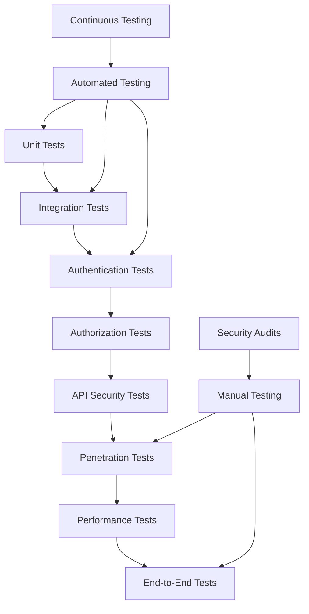

# Comprehensive Security Testing Suite

## Testing Strategy Overview

### Multi-Layer Security Testing Approach



### Testing Categories

1. **Authentication Security Tests** - Login, logout, token management
2. **Authorization Tests** - RBAC, permissions, resource access
3. **API Security Tests** - Input validation, injection attacks, rate limiting
4. **Session Management Tests** - Session hijacking, fixation, timeout
5. **Cross-Site Attack Tests** - XSS, CSRF, clickjacking prevention
6. **Data Security Tests** - Encryption, data leakage, PII protection
7. **Infrastructure Security Tests** - Headers, HTTPS, configuration
8. **Performance Security Tests** - DoS resistance, resource exhaustion

## 1. Authentication Security Tests

### Unit Tests for Auth Components

```typescript
// tests/auth/auth-unit.test.ts
import { describe, it, expect, beforeEach, jest } from '@jest/globals';
import { verifyAccessToken, generateTokenPair, refreshToken } from '@/lib/auth';
import { TokenManager } from '@/lib/secure-token';

describe('Authentication Unit Tests', () => {
  
  describe('Token Verification', () => {
    it('should verify valid JWT tokens', async () => {
      const token = await TokenManager.generateAccessToken(mockUser);
      const result = verifyAccessToken(token);
      
      expect(result).toBeTruthy();
      expect(result.userId).toBe(mockUser.id);
      expect(result.role).toBe(mockUser.role);
    });
    
    it('should reject expired tokens', async () => {
      const expiredToken = generateExpiredToken();
      const result = verifyAccessToken(expiredToken);
      
      expect(result).toBeNull();
    });
    
    it('should reject malformed tokens', () => {
      const malformedTokens = [
        'invalid.token',
        'not.a.jwt.token',
        '',
        null,
        undefined,
        'Bearer invalid',
        'valid.header.invalidsignature'
      ];
      
      malformedTokens.forEach(token => {
        const result = verifyAccessToken(token as any);
        expect(result).toBeNull();
      });
    });
    
    it('should validate token signature correctly', () => {
      const validToken = generateValidToken();
      const tamperedToken = tamperWithToken(validToken);
      
      expect(verifyAccessToken(validToken)).toBeTruthy();
      expect(verifyAccessToken(tamperedToken)).toBeNull();
    });
  });
  
  describe('Token Generation', () => {
    it('should generate unique tokens for each request', async () => {
      const token1 = await TokenManager.generateAccessToken(mockUser);
      const token2 = await TokenManager.generateAccessToken(mockUser);
      
      expect(token1).not.toBe(token2);
      
      const payload1 = decodeToken(token1);
      const payload2 = decodeToken(token2);
      
      expect(payload1.jti).not.toBe(payload2.jti);
    });
    
    it('should include all required claims', async () => {
      const token = await TokenManager.generateAccessToken(mockUser);
      const payload = decodeToken(token);
      
      expect(payload).toHaveProperty('userId');
      expect(payload).toHaveProperty('email');
      expect(payload).toHaveProperty('role');
      expect(payload).toHaveProperty('exp');
      expect(payload).toHaveProperty('iat');
      expect(payload).toHaveProperty('jti');
    });
  });
  
  describe('Token Refresh', () => {
    it('should generate new token pair on refresh', async () => {
      const { refreshToken } = await TokenManager.generateTokenPair(mockUser);
      const newPair = await TokenManager.refreshTokens(refreshToken);
      
      expect(newPair.accessToken).toBeDefined();
      expect(newPair.refreshToken).toBeDefined();
      expect(newPair.refreshToken).not.toBe(refreshToken);
    });
    
    it('should invalidate old refresh token', async () => {
      const { refreshToken } = await TokenManager.generateTokenPair(mockUser);
      await TokenManager.refreshTokens(refreshToken);
      
      // Old refresh token should no longer work
      await expect(
        TokenManager.refreshTokens(refreshToken)
      ).rejects.toThrow('Invalid refresh token');
    });
    
    it('should detect refresh token reuse', async () => {
      const { refreshToken } = await TokenManager.generateTokenPair(mockUser);
      
      // Use token once
      await TokenManager.refreshTokens(refreshToken);
      
      // Using same token again should trigger security alert
      await expect(
        TokenManager.refreshTokens(refreshToken)
      ).rejects.toThrow('Token reuse detected');
      
      // Should revoke entire token family
      const sessions = await getActiveSessionsForUser(mockUser.id);
      expect(sessions).toHaveLength(0);
    });
  });
});
```

### Integration Tests for Auth Flow

```typescript
// tests/auth/auth-integration.test.ts
import { testClient } from '@/tests/setup';
import { createTestUser, cleanupTestData } from '@/tests/helpers';

describe('Authentication Integration Tests', () => {
  
  beforeEach(async () => {
    await cleanupTestData();
  });
  
  describe('Login Flow', () => {
    it('should complete successful login flow', async () => {
      const user = await createTestUser();
      
      const response = await testClient.post('/api/auth/login', {
        email: user.email,
        password: 'testpassword'
      });
      
      expect(response.status).toBe(200);
      expect(response.data).toHaveProperty('accessToken');
      expect(response.headers['set-cookie']).toContain('refreshToken');
      
      // Verify token works for protected routes
      const protectedResponse = await testClient.get('/api/dashboard/summary', {
        headers: {
          Authorization: `Bearer ${response.data.accessToken}`
        }
      });
      
      expect(protectedResponse.status).toBe(200);
    });
    
    it('should handle invalid credentials', async () => {
      const response = await testClient.post('/api/auth/login', {
        email: 'invalid@example.com',
        password: 'wrongpassword'
      });
      
      expect(response.status).toBe(401);
      expect(response.data.error.message).toBe('Invalid credentials');
    });
    
    it('should enforce rate limiting on login attempts', async () => {
      const user = await createTestUser();
      
      // Make multiple failed login attempts
      const promises = Array.from({ length: 10 }, () =>
        testClient.post('/api/auth/login', {
          email: user.email,
          password: 'wrongpassword'
        }).catch(err => err.response)
      );
      
      const responses = await Promise.all(promises);
      const rateLimitedResponses = responses.filter(r => r.status === 429);
      
      expect(rateLimitedResponses.length).toBeGreaterThan(0);
    });
  });
  
  describe('Logout Flow', () => {
    it('should invalidate tokens on logout', async () => {
      const { user, accessToken } = await createAuthenticatedUser();
      
      // Logout
      await testClient.post('/api/auth/logout', {}, {
        headers: { Authorization: `Bearer ${accessToken}` }
      });
      
      // Token should no longer work
      const response = await testClient.get('/api/dashboard/summary', {
        headers: { Authorization: `Bearer ${accessToken}` }
      });
      
      expect(response.status).toBe(401);
    });
  });
  
  describe('Session Management', () => {
    it('should track active sessions', async () => {
      const { user, accessToken } = await createAuthenticatedUser();
      
      const sessions = await getActiveSessionsForUser(user.id);
      expect(sessions).toHaveLength(1);
      expect(sessions[0].isActive).toBe(true);
    });
    
    it('should handle concurrent logins', async () => {
      const user = await createTestUser();
      
      // Login from multiple "devices"
      const login1 = await testClient.post('/api/auth/login', {
        email: user.email,
        password: 'testpassword'
      }, {
        headers: { 'User-Agent': 'Device1' }
      });
      
      const login2 = await testClient.post('/api/auth/login', {
        email: user.email,
        password: 'testpassword'
      }, {
        headers: { 'User-Agent': 'Device2' }
      });
      
      expect(login1.status).toBe(200);
      expect(login2.status).toBe(200);
      
      // Both sessions should be active
      const sessions = await getActiveSessionsForUser(user.id);
      expect(sessions).toHaveLength(2);
    });
  });
});
```

## 2. Authorization & RBAC Tests

### Role-Based Access Control Tests

```typescript
// tests/auth/rbac.test.ts
import { Role } from '@/lib/rbac';
import { createUserWithRole, createAuthenticatedClient } from '@/tests/helpers';

describe('RBAC Authorization Tests', () => {
  
  describe('Role-Based API Access', () => {
    it('should enforce admin-only endpoints', async () => {
      const scenarios = [
        { role: Role.USER, expectedStatus: 403 },
        { role: Role.MODERATOR, expectedStatus: 403 },
        { role: Role.ADMIN, expectedStatus: 200 }
      ];
      
      for (const scenario of scenarios) {
        const client = await createAuthenticatedClient(scenario.role);
        const response = await client.get('/api/users');
        
        expect(response.status).toBe(scenario.expectedStatus);
      }
    });
    
    it('should enforce moderator-level access', async () => {
      const scenarios = [
        { role: Role.USER, expectedStatus: 403 },
        { role: Role.MODERATOR, expectedStatus: 200 },
        { role: Role.ADMIN, expectedStatus: 200 }
      ];
      
      for (const scenario of scenarios) {
        const client = await createAuthenticatedClient(scenario.role);
        const response = await client.get('/api/reports/financial');
        
        expect(response.status).toBe(scenario.expectedStatus);
      }
    });
    
    it('should allow user-level access to own resources', async () => {
      const user = await createUserWithRole(Role.USER);
      const client = await createAuthenticatedClient(Role.USER, user);
      
      // Create a client owned by the user
      const clientData = {
        name: 'Test Client',
        email: 'test@example.com',
        cnpjCpf: '12345678901'
      };
      
      const createResponse = await client.post('/api/clients', clientData);
      expect(createResponse.status).toBe(201);
      
      // User should be able to read their own client
      const readResponse = await client.get(`/api/clients/${createResponse.data.id}`);
      expect(readResponse.status).toBe(200);
    });
    
    it('should prevent users from accessing others resources', async () => {
      const user1 = await createUserWithRole(Role.USER);
      const user2 = await createUserWithRole(Role.USER);
      
      const client1 = await createAuthenticatedClient(Role.USER, user1);
      const client2 = await createAuthenticatedClient(Role.USER, user2);
      
      // User1 creates a client
      const createResponse = await client1.post('/api/clients', {
        name: 'User1 Client',
        email: 'user1@example.com',
        cnpjCpf: '12345678901'
      });
      
      // User2 should not be able to access User1's client
      const readResponse = await client2.get(`/api/clients/${createResponse.data.id}`);
      expect(readResponse.status).toBe(404); // 404 to avoid info leakage
    });
  });
  
  describe('Dynamic Authorization', () => {
    it('should prevent users from approving their own orders', async () => {
      const moderator = await createUserWithRole(Role.MODERATOR);
      const client = await createAuthenticatedClient(Role.MODERATOR, moderator);
      
      // Create an order
      const order = await client.post('/api/orders', {
        clientId: 1,
        description: 'Test Order',
        valorTotal: 1000
      });
      
      // Moderator should not be able to approve their own order
      const approveResponse = await client.post(`/api/orders/${order.data.id}/approve`);
      expect(approveResponse.status).toBe(403);
    });
    
    it('should enforce time-based access controls', async () => {
      const user = await createUserWithRole(Role.USER);
      const client = await createAuthenticatedClient(Role.USER, user);
      
      // Create an old order (simulate by directly creating in DB)
      const oldOrder = await createOldOrder(user.id, Date.now() - 25 * 60 * 60 * 1000); // 25 hours old
      
      // User should not be able to modify old orders
      const updateResponse = await client.put(`/api/orders/${oldOrder.id}`, {
        description: 'Updated description'
      });
      
      expect(updateResponse.status).toBe(403);
    });
  });
  
  describe('Field-Level Security', () => {
    it('should filter sensitive fields based on role', async () => {
      const scenarios = [
        {
          role: Role.USER,
          expectedFields: ['id', 'name', 'email'],
          forbiddenFields: ['cnpjCpf', 'internalNotes']
        },
        {
          role: Role.MODERATOR,
          expectedFields: ['id', 'name', 'email', 'cnpjCpf'],
          forbiddenFields: ['internalNotes']
        },
        {
          role: Role.ADMIN,
          expectedFields: ['id', 'name', 'email', 'cnpjCpf', 'internalNotes'],
          forbiddenFields: []
        }
      ];
      
      for (const scenario of scenarios) {
        const client = await createAuthenticatedClient(scenario.role);
        const response = await client.get('/api/clients');
        
        expect(response.status).toBe(200);
        
        if (response.data.length > 0) {
          const clientData = response.data[0];
          
          scenario.expectedFields.forEach(field => {
            expect(clientData).toHaveProperty(field);
          });
          
          scenario.forbiddenFields.forEach(field => {
            expect(clientData).not.toHaveProperty(field);
          });
        }
      }
    });
  });
});
```

## 3. API Security Tests

### Input Validation & Injection Tests

```typescript
// tests/security/api-security.test.ts
import { testClient } from '@/tests/setup';

describe('API Security Tests', () => {
  
  describe('SQL Injection Prevention', () => {
    it('should prevent SQL injection in query parameters', async () => {
      const client = await createAuthenticatedClient(Role.ADMIN);
      
      const maliciousPayloads = [
        "'; DROP TABLE clients; --",
        "1' OR '1'='1",
        "1; DELETE FROM users WHERE 1=1; --",
        "1' UNION SELECT * FROM users --"
      ];
      
      for (const payload of maliciousPayloads) {
        const response = await client.get(`/api/clients/${payload}`);
        
        // Should not cause server error or expose data
        expect([400, 404]).toContain(response.status);
        expect(response.data).not.toContain('users');
        expect(response.data).not.toContain('DROP');
      }
    });
    
    it('should prevent SQL injection in request body', async () => {
      const client = await createAuthenticatedClient(Role.ADMIN);
      
      const maliciousPayloads = [
        {
          name: "'; DROP TABLE clients; --",
          email: 'test@example.com'
        },
        {
          name: 'Test',
          email: "admin@example.com'; UPDATE users SET role='ADMIN' WHERE email='user@example.com'; --"
        }
      ];
      
      for (const payload of maliciousPayloads) {
        const response = await client.post('/api/clients', payload);
        
        // Should either be rejected or sanitized
        if (response.status === 201) {
          // Verify no SQL was executed
          const createdClient = response.data;
          expect(createdClient.name).not.toContain('DROP');
          expect(createdClient.email).not.toContain('UPDATE');
        } else {
          expect(response.status).toBe(400);
        }
      }
    });
  });
  
  describe('XSS Prevention', () => {
    it('should sanitize script tags in input', async () => {
      const client = await createAuthenticatedClient(Role.USER);
      
      const xssPayloads = [
        '<script>alert("xss")</script>',
        '"><script>alert("xss")</script>',
        '',
        'javascript:alert("xss")',
        '<svg/onload=alert("xss")>'
      ];
      
      for (const payload of xssPayloads) {
        const response = await client.post('/api/clients', {
          name: payload,
          email: 'test@example.com',
          cnpjCpf: '12345678901'
        });
        
        if (response.status === 201) {
          const client = response.data;
          expect(client.name).not.toContain('<script>');
          expect(client.name).not.toContain('javascript:');
          expect(client.name).not.toContain('onerror');
        }
      }
    });
  });
  
  describe('CSRF Protection', () => {
    it('should require CSRF token for state-changing operations', async () => {
      const client = await createAuthenticatedClient(Role.USER);
      
      // Remove CSRF token from client
      delete client.defaults.headers['x-csrf-token'];
      
      const response = await client.post('/api/clients', {
        name: 'Test Client',
        email: 'test@example.com'
      });
      
      expect(response.status).toBe(403);
      expect(response.data.error.message).toContain('CSRF');
    });
    
    it('should accept valid CSRF tokens', async () => {
      const client = await createAuthenticatedClient(Role.USER);
      
      // Get CSRF token
      const csrfResponse = await client.get('/api/auth/csrf-token');
      const csrfToken = csrfResponse.data.csrfToken;
      
      const response = await client.post('/api/clients', {
        name: 'Test Client',
        email: 'test@example.com'
      }, {
        headers: { 'x-csrf-token': csrfToken }
      });
      
      expect(response.status).toBe(201);
    });
  });
  
  describe('Rate Limiting', () => {
    it('should enforce API rate limits', async () => {
      const client = await createAuthenticatedClient(Role.USER);
      
      // Make rapid requests to trigger rate limit
      const requests = Array.from({ length: 150 }, (_, i) =>
        client.get('/api/clients').catch(err => err.response)
      );
      
      const responses = await Promise.all(requests);
      const rateLimitedResponses = responses.filter(r => r.status === 429);
      
      expect(rateLimitedResponses.length).toBeGreaterThan(0);
      
      // Check rate limit headers
      const rateLimitResponse = rateLimitedResponses[0];
      expect(rateLimitResponse.headers).toHaveProperty('x-ratelimit-limit');
      expect(rateLimitResponse.headers).toHaveProperty('x-ratelimit-remaining');
      expect(rateLimitResponse.headers).toHaveProperty('x-ratelimit-reset');
    });
    
    it('should have stricter limits for sensitive endpoints', async () => {
      const client = await createAuthenticatedClient(Role.USER);
      
      // Login endpoint should have stricter limits
      const loginRequests = Array.from({ length: 10 }, () =>
        testClient.post('/api/auth/login', {
          email: 'test@example.com',
          password: 'wrongpassword'
        }).catch(err => err.response)
      );
      
      const responses = await Promise.all(loginRequests);
      const rateLimitedResponses = responses.filter(r => r.status === 429);
      
      expect(rateLimitedResponses.length).toBeGreaterThan(0);
    });
  });
});
```

## 4. Session Security Tests

```typescript
// tests/security/session-security.test.ts
describe('Session Security Tests', () => {
  
  describe('Session Hijacking Prevention', () => {
    it('should bind session to device fingerprint', async () => {
      const user = await createTestUser();
      
      // Login with specific user agent
      const loginResponse = await testClient.post('/api/auth/login', {
        email: user.email,
        password: 'testpassword'
      }, {
        headers: { 'User-Agent': 'TestBrowser/1.0' }
      });
      
      const accessToken = loginResponse.data.accessToken;
      
      // Try to use token with different user agent
      const response = await testClient.get('/api/dashboard/summary', {
        headers: {
          'Authorization': `Bearer ${accessToken}`,
          'User-Agent': 'DifferentBrowser/2.0'
        }
      });
      
      // Should be rejected due to device mismatch
      expect(response.status).toBe(401);
    });
    
    it('should detect impossible travel scenarios', async () => {
      const user = await createTestUser();
      
      // Login from one location
      await testClient.post('/api/auth/login', {
        email: user.email,
        password: 'testpassword'
      }, {
        headers: { 'x-forwarded-for': '203.0.113.1' } // New York IP
      });
      
      // Immediate login from distant location
      const response = await testClient.post('/api/auth/login', {
        email: user.email,
        password: 'testpassword'
      }, {
        headers: { 'x-forwarded-for': '198.51.100.1' } // Tokyo IP
      });
      
      // Should trigger security alert
      expect(response.status).toBe(200); // Login succeeds
      
      // But security event should be logged
      const securityEvents = await getSecurityEventsForUser(user.id);
      expect(securityEvents.some(e => e.type === 'unusual_location')).toBe(true);
    });
  });
  
  describe('Session Fixation Prevention', () => {
    it('should regenerate session ID on login', async () => {
      const user = await createTestUser();
      
      // Get initial session (anonymous)
      const initialResponse = await testClient.get('/api/auth/csrf-token');
      const initialSessionId = extractSessionId(initialResponse);
      
      // Login
      const loginResponse = await testClient.post('/api/auth/login', {
        email: user.email,
        password: 'testpassword'
      });
      
      const postLoginSessionId = extractSessionId(loginResponse);
      
      // Session ID should change after login
      expect(postLoginSessionId).not.toBe(initialSessionId);
    });
  });
  
  describe('Session Timeout', () => {
    it('should expire inactive sessions', async () => {
      const client = await createAuthenticatedClient(Role.USER);
      
      // Mock time progression
      jest.advanceTimersByTime(25 * 60 * 1000); // 25 minutes
      
      const response = await client.get('/api/dashboard/summary');
      expect(response.status).toBe(401);
    });
    
    it('should extend session on activity', async () => {
      const client = await createAuthenticatedClient(Role.USER);
      
      // Make request to extend session
      await client.get('/api/clients');
      
      // Advance time but less than timeout
      jest.advanceTimersByTime(10 * 60 * 1000); // 10 minutes
      
      const response = await client.get('/api/dashboard/summary');
      expect(response.status).toBe(200);
    });
  });
});
```

## 5. Penetration Testing Suite

### Automated Security Scanning

```typescript
// tests/security/penetration.test.ts
import { OWASP_TOP_10_TESTS } from '@/tests/security/owasp-tests';

describe('Penetration Testing Suite', () => {
  
  describe('OWASP Top 10 Tests', () => {
    it('should pass injection attack tests', async () => {
      const results = await OWASP_TOP_10_TESTS.runInjectionTests();
      
      results.forEach(result => {
        expect(result.passed).toBe(true);
        expect(result.vulnerabilities).toHaveLength(0);
      });
    });
    
    it('should pass broken authentication tests', async () => {
      const results = await OWASP_TOP_10_TESTS.runAuthenticationTests();
      
      expect(results.bruteForceProtection).toBe(true);
      expect(results.sessionManagement).toBe(true);
      expect(results.passwordSecurity).toBe(true);
    });
    
    it('should pass sensitive data exposure tests', async () => {
      const results = await OWASP_TOP_10_TESTS.runDataExposureTests();
      
      expect(results.encryptionInTransit).toBe(true);
      expect(results.encryptionAtRest).toBe(true);
      expect(results.dataLeakage).toBe(false);
    });
  });
  
  describe('Custom Vulnerability Tests', () => {
    it('should test for authentication bypass vulnerabilities', async () => {
      const bypassAttempts = [
        // Header manipulation
        { headers: { 'x-user-id': '1', 'x-user-role': 'ADMIN' } },
        // Cookie manipulation
        { cookies: { 'accessToken': 'fake-token' } },
        // Parameter pollution
        { query: { userId: ['1', '2'] } },
        // HTTP method override
        { method: 'GET', headers: { 'X-HTTP-Method-Override': 'DELETE' } }
      ];
      
      for (const attempt of bypassAttempts) {
        const response = await testClient.request({
          url: '/api/users',
          ...attempt
        });
        
        expect(response.status).toBe(401);
      }
    });
    
    it('should test for privilege escalation', async () => {
      const userClient = await createAuthenticatedClient(Role.USER);
      
      // Attempt to escalate privileges through various methods
      const escalationAttempts = [
        () => userClient.put('/api/users/1', { role: 'ADMIN' }),
        () => userClient.post('/api/auth/promote', { userId: 1 }),
        () => userClient.get('/api/admin/settings'),
        () => userClient.delete('/api/users/2')
      ];
      
      for (const attempt of escalationAttempts) {
        const response = await attempt().catch(err => err.response);
        expect([401, 403, 404]).toContain(response.status);
      }
    });
  });
});
```

### Security Test Automation

```typescript
// tests/security/automated-security.test.ts
class SecurityTestRunner {
  
  async runDailyScanPulse(): Promise<SecurityScanResult> {
    const results: SecurityScanResult = {
      timestamp: new Date(),
      tests: [],
      overallScore: 0,
      criticalIssues: [],
      recommendations: []
    };
    
    // Run all security test suites
    const testSuites = [
      this.runAuthenticationTests(),
      this.runAuthorizationTests(),
      this.runInputValidationTests(),
      this.runSessionSecurityTests(),
      this.runDataProtectionTests(),
      this.runInfrastructureTests()
    ];
    
    const suiteResults = await Promise.all(testSuites);
    
    results.tests = suiteResults.flat();
    results.overallScore = this.calculateOverallScore(results.tests);
    results.criticalIssues = results.tests.filter(t => t.severity === 'CRITICAL' && !t.passed);
    results.recommendations = this.generateRecommendations(results.tests);
    
    return results;
  }
  
  private async runAuthenticationTests(): Promise<SecurityTest[]> {
    return [
      await this.testPasswordPolicy(),
      await this.testBruteForceProtection(),
      await this.testTokenSecurity(),
      await this.testSessionManagement(),
      await this.testMultiFactorAuth()
    ];
  }
  
  private async testTokenSecurity(): Promise<SecurityTest> {
    const tests = [
      () => this.verifyTokenEncryption(),
      () => this.verifyTokenExpiration(),
      () => this.verifyTokenRevocation(),
      () => this.verifyRefreshTokenRotation()
    ];
    
    const results = await Promise.all(tests.map(test => test().catch(() => false)));
    const passed = results.every(Boolean);
    
    return {
      name: 'Token Security',
      passed,
      severity: 'HIGH',
      details: passed ? 'All token security checks passed' : 'Token security issues detected'
    };
  }
}
```

## 6. Performance Security Tests

```typescript
// tests/security/performance-security.test.ts
describe('Performance Security Tests', () => {
  
  describe('DoS Resistance', () => {
    it('should handle high request volumes', async () => {
      const client = await createAuthenticatedClient(Role.USER);
      const startTime = Date.now();
      
      // Send 1000 concurrent requests
      const requests = Array.from({ length: 1000 }, () =>
        client.get('/api/clients').catch(err => err.response)
      );
      
      const responses = await Promise.all(requests);
      const endTime = Date.now();
      
      // Server should remain responsive
      const avgResponseTime = (endTime - startTime) / responses.length;
      expect(avgResponseTime).toBeLessThan(5000); // 5 seconds average
      
      // Some requests may be rate limited but server shouldn't crash
      const successResponses = responses.filter(r => r.status === 200);
      expect(successResponses.length).toBeGreaterThan(0);
    });
    
    it('should prevent resource exhaustion attacks', async () => {
      const client = await createAuthenticatedClient(Role.USER);
      
      // Attempt to exhaust memory with large payloads
      const largePayload = 'x'.repeat(10 * 1024 * 1024); // 10MB
      
      const response = await client.post('/api/clients', {
        name: largePayload,
        email: 'test@example.com'
      }).catch(err => err.response);
      
      // Should reject oversized payloads
      expect([400, 413]).toContain(response.status);
    });
  });
  
  describe('Slowloris Attack Prevention', () => {
    it('should timeout slow requests', async () => {
      const client = await createAuthenticatedClient(Role.USER);
      
      // Simulate slow request by delaying chunks
      const response = await client.post('/api/clients', 
        new ReadableStream({
          start(controller) {
            setTimeout(() => {
              controller.enqueue('{"name":"test"');
              setTimeout(() => {
                controller.enqueue(',"email":"test@example.com"}');
                controller.close();
              }, 35000); // 35 second delay
            }, 1000);
          }
        })
      ).catch(err => err.response);
      
      // Should timeout before completion
      expect(response.status).toBe(408);
    });
  });
});
```

## 7. Security Test Reporting

```typescript
// tests/security/reporting.ts
interface SecurityTestReport {
  timestamp: Date;
  environment: string;
  overallRating: 'SECURE' | 'WARNING' | 'CRITICAL';
  testResults: SecurityTestResult[];
  metrics: SecurityMetrics;
  recommendations: SecurityRecommendation[];
}

class SecurityReportGenerator {
  
  async generateReport(): Promise<SecurityTestReport> {
    const testResults = await this.runAllSecurityTests();
    const metrics = await this.collectSecurityMetrics();
    
    return {
      timestamp: new Date(),
      environment: process.env.NODE_ENV || 'development',
      overallRating: this.calculateOverallRating(testResults),
      testResults,
      metrics,
      recommendations: this.generateRecommendations(testResults)
    };
  }
  
  private calculateOverallRating(results: SecurityTestResult[]): 'SECURE' | 'WARNING' | 'CRITICAL' {
    const criticalFailures = results.filter(r => !r.passed && r.severity === 'CRITICAL');
    const highFailures = results.filter(r => !r.passed && r.severity === 'HIGH');
    
    if (criticalFailures.length > 0) return 'CRITICAL';
    if (highFailures.length > 2) return 'WARNING';
    return 'SECURE';
  }
  
  private generateRecommendations(results: SecurityTestResult[]): SecurityRecommendation[] {
    const recommendations: SecurityRecommendation[] = [];
    
    const failedTests = results.filter(r => !r.passed);
    
    failedTests.forEach(test => {
      switch (test.category) {
        case 'authentication':
          recommendations.push({
            priority: test.severity,
            category: 'Authentication',
            description: 'Strengthen authentication mechanisms',
            action: 'Implement MFA and improve password policies'
          });
          break;
        case 'authorization':
          recommendations.push({
            priority: test.severity,
            category: 'Authorization',
            description: 'Review and enhance access controls',
            action: 'Audit RBAC implementation and permissions'
          });
          break;
