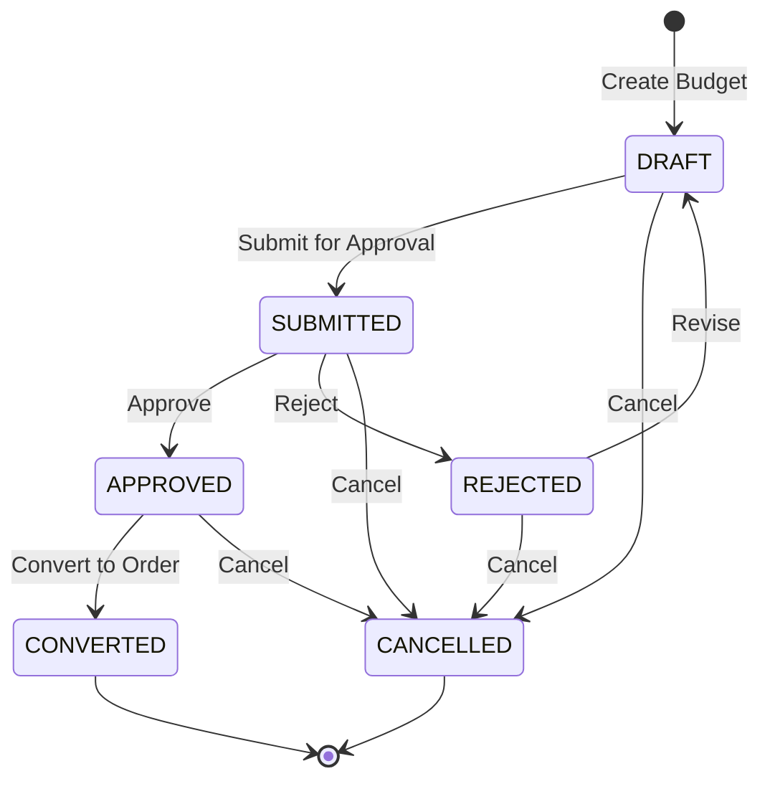
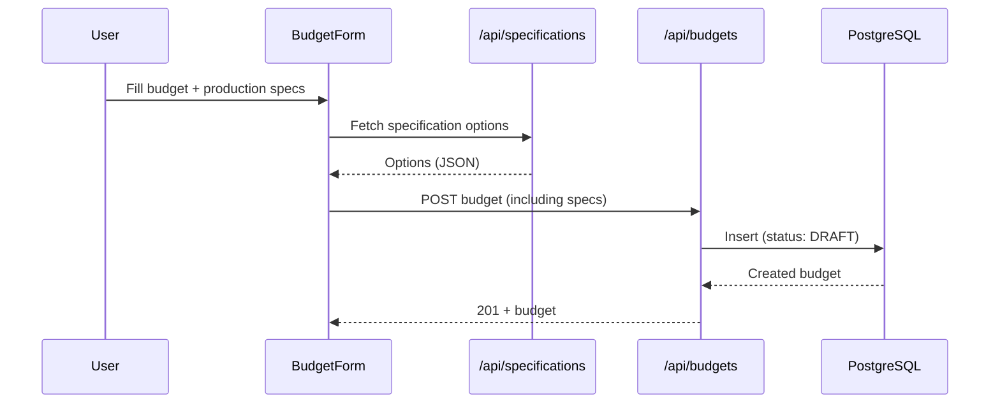

# Budget System Migration Architecture

Document Version: 1.1
Date: 2025-10-07
Project: AlphaBook Budget Form Enhancement
Scope: End‑to‑end architecture for restoring production specifications and aligning budget flows with the legacy system, per BUDGET_CORRECTION.md

---

## Executive Summary

This document consolidates the corrections and implementation guidance from `docs/BUDGET_CORRECTION.md` into a cohesive migration architecture. It documents how the eight production specification fields are incorporated into the modern React app, confirms no database migration is required, and details APIs, validation, feature flags, testing, rollout, and metrics.

Key Decisions
- Zero DB migration: All columns already exist in PostgreSQL.
- Progressive enhancement: New UI/validation added without breaking flows.
- Feature-flag rollout: Controlled enablement and fast rollback.
- JSON-backed specs, Phase 2 DB enums: Start with JSON; plan enum tables later.
- Comprehensive tests and analytics: Measure adoption, quality, and performance.

---

## 1. Architecture Overview

### 1.1 Current Target Architecture (Phase 1)

```mermaid
graph TB
  subgraph Frontend (React)
    BF[BudgetForm]
    PS[ProductionSpecificationsSection]
    SH[useSpecifications Hook]
    VAL[Zod Validation]
    FF[Feature Flags]
  end

  subgraph Backend (Next.js)
    API_BUDGET[/api/budgets]
    API_SPEC[/api/specifications]
    AUTH[API Auth]
    PRISMA[Prisma]
  end

  subgraph Database (PostgreSQL)
    BUDGET[(Budget table)]
    CLIENT[(Client)]
    CENTER[(Center)]
  end

  BF --> PS --> SH --> API_SPEC
  BF --> VAL
  BF --> FF
  BF --> API_BUDGET
  API_BUDGET --> AUTH --> PRISMA --> BUDGET
  PRISMA --> CLIENT
  PRISMA --> CENTER

  style PS fill:#f6d,stroke:#333,stroke-width:2px
  style API_SPEC fill:#def,stroke:#333,stroke-width:1px
  style BUDGET fill:#bbf,stroke:#333,stroke-width:2px
```

### 1.2 Future Architecture (Phase 2 – Optional)

```mermaid
graph TB
  subgraph Backend (Next.js)
    API_SPEC[/api/specifications]
    PRISMA[Prisma]
  end

  subgraph Database (PostgreSQL)
    BUDGET[(Budget)]
    SPEC_OPT[(Specification Option Tables)]
  end

  API_SPEC --> PRISMA --> SPEC_OPT
  PRISMA --> BUDGET

  style SPEC_OPT fill:#bbf,stroke:#333,stroke-dasharray: 5 5
```

Spec option tables are an optimization for integrity/reporting and are not required to complete the migration.

---

## 2. Goals, Scope, and Deliverables

Goals
- Restore the eight production specification fields in the modern budget form:
  - `cor_miolo`, `papel_miolo`, `papel_capa`, `cor_capa`, `laminacao`, `acabamento`, `shrink`, `centro_producao`
- Preserve DB compatibility; no schema changes required.
- Provide a reliable Specifications API backed by JSON (Phase 1).
- Gate new UI behind feature flags and ship progressively.
- Add tests, monitoring, and KPIs to validate adoption and quality.

Out of Scope
- Pricing engines, ERP/production systems integration, and enum tables (Phase 2+).

Primary Deliverables
- Feature-flagged `ProductionSpecificationsSection` integrated into `BudgetForm`.
- `GET /api/specifications` reading `src/lib/especificacoes.json`.
- Updated validation (client and server) for new optional fields and business rules.
- Documentation of workflow endpoints and state machine.
- Testing plan and acceptance criteria.

---

## 3. Component Architecture

Form Structure (actual)
```
BudgetForm
- Client and Center (existing)
- Project Identification (existing)
- Basic Specifications (existing)
- Production Specifications (new, feature-flagged)
  • Papel miolo, Papel capa
  • Cor miolo, Cor capa
  • Laminação, Acabamento, Shrink
  • Centro de produção
- Business Terms (existing)
- Timeline (existing)
- Additional Information (enhanced: frete via flag)
```

Key Files
- Form: `alphabook_web/src/components/forms/budget-form.tsx`
- Production section: `alphabook_web/src/components/forms/budget-form/ProductionSpecificationsSection.tsx`
- Specs hook: `alphabook_web/src/hooks/useSpecifications.ts`
- Feature flags: `alphabook_web/src/lib/feature-flags.ts`
- Validation: `alphabook_web/src/lib/validation.ts`

Notes
- `ProductionSpecificationsSection` is rendered when `PRODUCTION_SPECIFICATIONS` is enabled.
- `frete` field is gated by `FREIGHT_FIELD` for Additional Information.
- Conditional logic: selecting "Sem capa" disables capa-related fields and clears values.

---

## 4. Data Layer and APIs

Specifications API
- Endpoint: `GET /api/specifications`
- Source (Phase 1): `alphabook_web/src/lib/especificacoes.json`
- Security: `requireApiAuth` (all authenticated users can read)
- Response shape
  - `data`: object keyed by category (e.g., "Tipo de Papel miolo") with string arrays
  - `metadata`: `{ version, lastUpdated, source, categories, totalOptions }`

Implementation Reference
- Route: `alphabook_web/src/app/api/specifications/route.ts`
- Reads and parses `src/lib/especificacoes.json`, computes metadata, returns `{ data, metadata }`.
- Optional POST supports admin updates with on-disk backup.

Budgets API
- Endpoint: `POST /api/budgets`
- Validation: `BudgetSchema` (`alphabook_web/src/lib/validation.ts`)
- Behavior
  - Auth required; `Role.USER` cannot create.
  - Validates `clientId` and `centerId` are active.
  - Auto-generates `numero_pedido` and sets `status: DRAFT`.
  - Persists optional specification fields (`cor_miolo` ... `centro_producao`).
- Reference: `alphabook_web/src/app/api/budgets/route.ts`

Hook and Caching
- `useSpecifications` uses TanStack Query with fallback to built-in constants when API is unavailable.
- Stale time: 30m; cache time: 60m.

---

## 5. Validation Architecture

Client and Server Validation
- Server endpoints currently use `BudgetSchema` (spec fields optional strings) for compatibility.
- Enhanced cross-field validation is available via `EnhancedBudgetSchema` and `ProductionSpecificationsSchema` for stricter rules.
- Conditional rules (examples):
  - If `cor_capa === "Sem capa"` then `papel_capa` and `laminacao` must be empty.
  - If `cor_capa === "Fichário"` then lamination does not apply.

Key Files
- `alphabook_web/src/lib/validation.ts` (BudgetSchema, ProductionSpecificationsSchema, EnhancedBudgetSchema)
- `alphabook_web/src/lib/specifications-enums.ts` (Option lists and helpers)

Recommendation
- Keep server strictness at `BudgetSchema` during rollout; graduate to `EnhancedBudgetSchema` after adoption (via flag).

---

## 6. Feature Flags and Rollout

Flags (client-side)
- `PRODUCTION_SPECIFICATIONS`: render the production section
- `FREIGHT_FIELD`: enable `frete` field
- `ENHANCED_VALIDATION`: enable stricter client-side validation
- `SPECIFICATION_ANALYTICS`: enable usage/error analytics
- `CONDITIONAL_FIELDS`: enable conditional UI behavior

Configuration
- Env vars: `NEXT_PUBLIC_<FLAG>` set to `true|false`
- Local overrides: `localStorage.setItem('ff_<FLAG>', 'true|false')`
- File: `alphabook_web/src/lib/feature-flags.ts`

Example (.env.local)
```
NEXT_PUBLIC_PRODUCTION_SPECIFICATIONS=true
NEXT_PUBLIC_FREIGHT_FIELD=true
NEXT_PUBLIC_ENHANCED_VALIDATION=false
NEXT_PUBLIC_SPECIFICATION_ANALYTICS=false
NEXT_PUBLIC_CONDITIONAL_FIELDS=true
```

Rollout
- Start with `PRODUCTION_SPECIFICATIONS` and `FREIGHT_FIELD` enabled for a pilot group.
- Monitor validation errors and completion rates; then enable `ENHANCED_VALIDATION`.

---

## 7. Workflows and State Machine

Budget Lifecycle


Workflow Endpoints (already implemented)
- `POST /api/budgets/[id]/submit`
- `POST /api/budgets/[id]/approve`
- `POST /api/budgets/[id]/reject`
- `POST /api/budgets/[id]/convert-to-order`

Sequence (Create Budget with Specifications)


---

## 8. Data Model and Storage Strategy

Status (from BUDGET_CORRECTION.md)
- All specification columns exist in the `Budget` model; no DB migration required.
- Fields remain optional; existing budgets with NULLs remain valid.

Phase 1
- Source enumerations from `src/lib/especificacoes.json` and/or TS constants.

Phase 2 (optional)
- Migrate enumerations to dedicated option tables for integrity, ordering, and analytics.
- Consider indexes for frequent queries:
  - `budgets(papel_miolo)`, `budgets(acabamento)`, `budgets(centro_producao)`

---

## 9. Testing Strategy

Unit Tests
- Form renders and loads options (mock Specifications API).
- Validation accepts valid values and rejects invalid ones.

Integration / E2E
- Create/edit budget including production specs; verify persistence.
- Conditional logic: ensure capa-related fields clear when "Sem capa".

Contract Tests (API)
- `/api/specifications` returns all categories and known values.
- `/api/budgets` accepts/persists spec fields.

Suggested Locations
- Component tests: `alphabook_web/src/components/forms/__tests__/budget-form.test.tsx`
- API tests: `alphabook_web/src/app/api/specifications/__tests__/route.test.ts`
- E2E: `cypress/tests/budget-creation.spec.ts`

---

## 10. Monitoring and Analytics

Goals
- Measure adoption of spec fields; surface validation pain points.

Implementation
- Library: `alphabook_web/src/lib/analytics.ts`
- Events: `specification_field_used`, `specification_section_completed`, `specification_validation_error`, `budget_form_submission`.
- Enable via `SPECIFICATION_ANALYTICS` flag.

KPIs
- Form completion rate including specs (target: 95%).
- Validation error rate for spec fields (target: trending down to <2%).
- User adoption (target: 90% using spec fields within 30 days).

---

## 11. Backward Compatibility

Data Compatibility
- No schema changes; existing records remain valid.
- Editing existing budgets initializes missing spec fields to empty values.

API Compatibility
- New fields are optional; responses include them when present.
- No version bump required; existing consumers unaffected.

UX Considerations
- Group specs in a dedicated section; use help text and clear optionality.
- Maintain mobile responsiveness and accessibility.

---

## 12. Risks and Rollback

Technical Risks
- Increased form complexity may impact performance.
- Specs file encoding issues could affect option labels.

Mitigations
- Lazy load and cache options; monitor performance metrics.
- Validate and sanitize JSON data; plan Phase 2 enum tables.

Rollback
- Disable flags and redeploy; prior flows remain.
- No DB rollback necessary (non-destructive; optional fields).

---

## 13. Implementation Timeline

Phase 1 (complete or in progress)
- `ProductionSpecificationsSection` implemented and gated.
- Specifications API backed by JSON.
- Budget API persists optional spec fields.

Phase 2 (next)
- Integrate production center selection with the `Center` table where appropriate.
- Consider moving enumerations to DB tables; add indexes.
- Enable enhanced validation after monitoring.

---

## 14. Acceptance Criteria

Functional
- All 8 specification fields present and persisted.
- Dropdown options load reliably with graceful fallback.
- Conditional rules enforced client-side; server remains permissive until adoption.
- Existing budgets can be edited without breakage.

Non‑Functional
- Form load < 2s; responsive and accessible (WCAG 2.1 AA).
- Feature flags support progressive rollout and instant rollback.
- Analytics capture usage and validation errors (when enabled).

---

## 15. References

- Corrections: `alphabook_web/docs/BUDGET_CORRECTION.md`
- Legacy specs: `ED/especificacoes.json`
- Phase 1 specs: `alphabook_web/src/lib/especificacoes.json`
- Form: `alphabook_web/src/components/forms/budget-form.tsx`
- Production section: `alphabook_web/src/components/forms/budget-form/ProductionSpecificationsSection.tsx`
- Specs API: `alphabook_web/src/app/api/specifications/route.ts`
- Budget API: `alphabook_web/src/app/api/budgets/route.ts`
- Validation: `alphabook_web/src/lib/validation.ts`
- Feature flags: `alphabook_web/src/lib/feature-flags.ts`

