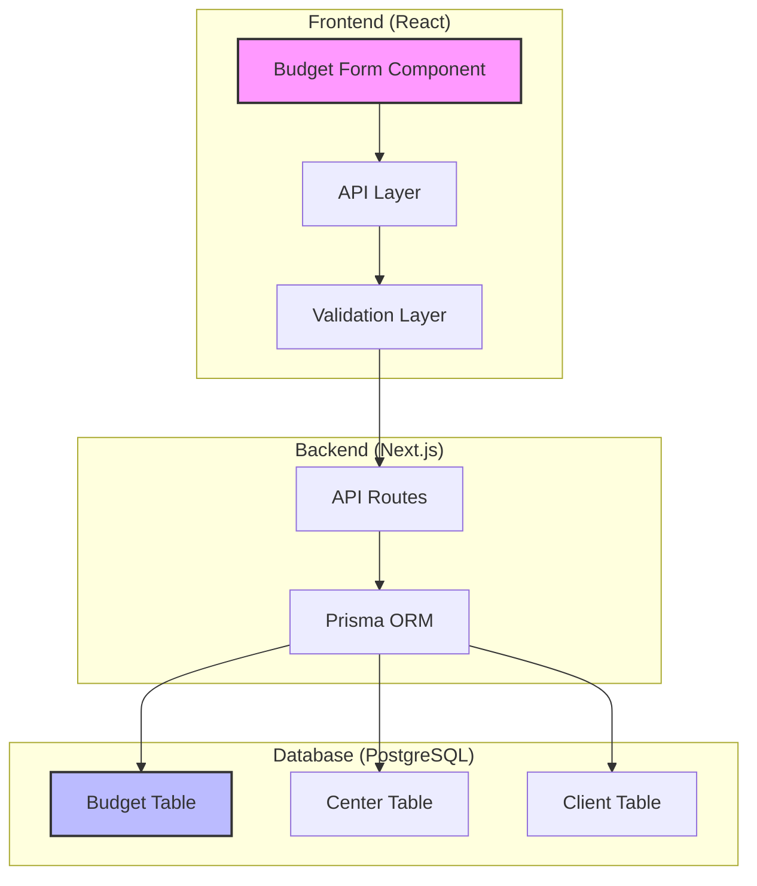
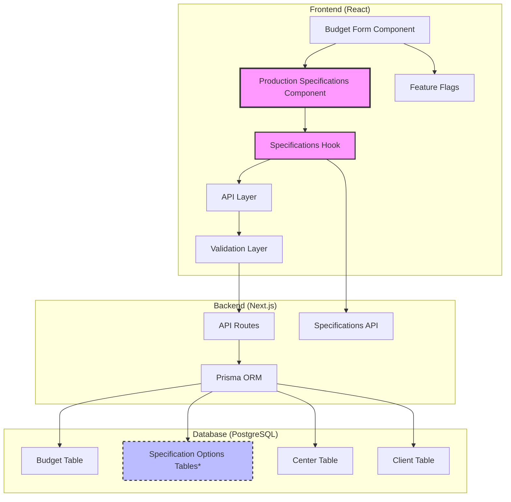

# Budget System Migration Architecture

**Document Version:** 1.0
**Date:** 2025-01-06
**Project:** AlphaBook Budget Form Enhancement
**Scope:** Migration of Production Specification Fields from Legacy to Modern System

---

## Executive Summary

This document outlines the technical architecture for migrating 8 critical production specification fields from the legacy budget system to the modern React-based application. The migration focuses on frontend form enhancement since the database schema already supports all required fields.

**Key Architecture Decisions:**
1. **Zero Database Migration** - All columns exist in PostgreSQL
2. **Progressive Enhancement** - Existing functionality remains intact
3. **Feature-Flag Controlled Rollout** - Safe deployment strategy
4. **Component-Based Architecture** - Maintainable and scalable implementation

---

## 1. System Architecture Overview

### 1.1 Current Architecture



### 1.2 Target Architecture



*Specification Options Tables are optional for Phase 2

---

## 2. Component Architecture

### 2.1 Form Component Hierarchy

```
BudgetForm (Main Component)
├── ClientAndCenterSection (Existing)
├── ProjectIdentificationSection (Existing)
├── BasicSpecificationsSection (Existing)
├── ProductionSpecificationsSection (NEW)
│   ├── PaperSpecificationsFields
│   │   ├── PapelMioloField
│   │   └── PapelCapaField
│   ├── ColorSpecificationsFields
│   │   ├── CorMioloField
│   │   └── CorCapaField
│   ├── FinishingSpecificationsFields
│   │   ├── LaminacaoField
│   │   ├── AcabamentoField
│   │   └── ShrinkField
│   └── ProductionCenterField
├── BusinessTermsSection (Existing)
├── TimelineSection (Existing)
└── AdditionalInformationSection (Enhanced)
    └── FreightField (NEW)
```

### 2.2 Component Specifications

#### ProductionSpecificationsSection

**Location:** `src/components/forms/budget-form/ProductionSpecificationsSection.tsx`

```typescript
interface ProductionSpecificationsSectionProps {
  specifications?: SpecificationData;
  initialData?: Partial<Budget>;
  canEdit: boolean;
  onFieldChange: (field: string, value: string) => void;
  errors?: Record<string, string>;
}

interface SpecificationData {
  "Tipo de Papel miolo": string[];
  "Tipo de Papel de Capa": string[];
  "Cor do miolo": string[];
  "Cor da capa": string[];
  "Tipo de laminação": string[];
  "Tipo de acabamento": string[];
  "Shrink": string[];
  "Centro de Produção": string[];
}
```

**Key Features:**
- Responsive grid layout (2-3 columns based on field grouping)
- Conditional field visibility (e.g., hide capa fields when "Sem capa" selected)
- Loading states for specification data
- Error handling and validation display
- Accessibility compliance (ARIA labels, keyboard navigation)

#### SpecificationField Component

**Location:** `src/components/forms/budget-form/SpecificationField.tsx`

```typescript
interface SpecificationFieldProps {
  label: string;
  name: string;
  value?: string;
  options: string[];
  disabled: boolean;
  onChange: (value: string) => void;
  error?: string;
  placeholder?: string;
  helpText?: string;
}
```

**Features:**
- Reusable dropdown/input component
- Automatic fallback to text input if no options available
- Integrated error display
- Loading and disabled states
- Touch-friendly mobile interface

---

## 3. Data Layer Architecture

### 3.1 API Layer Design

#### Specifications API

**Endpoint:** `GET /api/specifications`

**Response Format:**
```typescript
interface SpecificationResponse {
  data: SpecificationData;
  metadata: {
    version: string;
    lastUpdated: string;
    source: 'json' | 'database';
  };
}
```

**Implementation:**
```typescript
// src/app/api/specifications/route.ts
export async function GET() {
  const specifications = await getSpecifications();

  return NextResponse.json({
    data: specifications,
    metadata: {
      version: '1.0',
      lastUpdated: new Date().toISOString(),
      source: 'json' // Phase 1, later 'database'
    }
  });
}

async function getSpecifications(): Promise<SpecificationData> {
  // Phase 1: Load from JSON file
  const response = await fetch('/api/specifications/json');
  return response.json();

  // Phase 2: Load from database
  // return await prisma.specificationOption.findMany(...);
}
```

#### Budget API Enhancement

**Enhanced POST Endpoint:**
```typescript
// src/app/api/budgets/route.ts
export async function POST(request: NextRequest) {
  try {
    const json = await request.json();

    // Enhanced validation with new fields
    const data = EnhancedBudgetSchema.parse(json);

    // Extract specification fields
    const specificationFields = {
      cor_miolo: data.cor_miolo,
      papel_miolo: data.papel_miolo,
      papel_capa: data.papel_capa,
      cor_capa: data.cor_capa,
      laminacao: data.laminacao,
      acabamento: data.acabamento,
      shrink: data.shrink,
      centro_producao: data.centro_producao,
    };

    const budget = await prisma.budget.create({
      data: {
        ...data,
        ...specificationFields,
        // Maintain existing relationships
        client: data.clientId ? { connect: { id: data.clientId } } : undefined,
        center: data.centerId ? { connect: { id: data.centerId } } : undefined,
      },
      include: {
        client: true,
        center: true,
      },
    });

    // Track specification usage for analytics
    await trackSpecificationUsage(budget);

    return NextResponse.json({ data: budget }, { status: 201 });
  } catch (error) {
    return handleApiError(error);
  }
}
```

### 3.2 Validation Layer Architecture

#### Enhanced Budget Schema

**Location:** `src/lib/validations/budget.ts`

```typescript
import { z } from 'zod';
import { SPECIFICATION_OPTIONS } from '@/lib/specifications-enums';

// Base schema for all budget fields
const BaseBudgetSchema = z.object({
  // Existing required fields
  titulo: z.string().min(1, 'Título é obrigatório'),
  tiragem: z.number().min(1, 'Tiragem deve ser maior que 0'),
  formato: z.string().min(1, 'Formato é obrigatório'),
  total_pgs: z.number().min(0, 'Total de páginas deve ser maior ou igual a 0'),
  pgs_colors: z.number().min(0, 'Páginas coloridas deve ser maior ou igual a 0'),
  preco_unitario: z.number().min(0, 'Preço unitário deve ser maior ou igual a 0'),
  clientId: z.number().optional(),
  centerId: z.number().optional(),
});

// Production specification schema
const ProductionSpecificationsSchema = z.object({
  cor_miolo: z.enum(SPECIFICATION_OPTIONS.COR_MIOLO).optional(),
  papel_miolo: z.enum(SPECIFICATION_OPTIONS.PAPEL_MIOLO).optional(),
  papel_capa: z.enum(SPECIFICATION_OPTIONS.PAPEL_CAPA).optional(),
  cor_capa: z.enum(SPECIFICATION_OPTIONS.COR_CAPA).optional(),
  laminacao: z.enum(SPECIFICATION_OPTIONS.LAMINACAO).optional(),
  acabamento: z.enum(SPECIFICATION_OPTIONS.ACABAMENTO).optional(),
  shrink: z.enum(SPECIFICATION_OPTIONS.SHRINK).optional(),
  centro_producao: z.enum(SPECIFICATION_OPTIONS.CENTRO_PRODUCAO).optional(),
}).refine(
  (data) => {
    // Business rule: If capa is "Sem capa", other capa fields should be empty
    if (data.cor_capa === "Sem capa") {
      return !data.papel_capa && !data.laminacao;
    }
    return true;
  },
  {
    message: "Campos da capa devem estar vazios quando 'Sem capa' é selecionado",
    path: ["cor_capa"],
  }
);

// Combined schema
export const EnhancedBudgetSchema = BaseBudgetSchema.merge(ProductionSpecificationsSchema);

// Type exports
export type EnhancedBudget = z.infer<typeof EnhancedBudgetSchema>;
export type ProductionSpecifications = z.infer<typeof ProductionSpecificationsSchema>;
```

#### Specification Enums

**Location:** `src/lib/specifications-enums.ts`

```typescript
export const SPECIFICATION_OPTIONS = {
  COR_MIOLO: ["4/0", "4/4", "1/0", "1/1"] as const,
  PAPEL_MIOLO: [
    "offset 75g",
    "offset 90g",
    "pólen Soft Nat 80g",
    "pólen Bold 90g",
    "pólen Bold 70g",
    "couchê 90g",
    "couchê 115g",
    "couchê 150g",
    "Avena 70g",
    "Avena 80g",
    "off set 120g"
  ] as const,
  PAPEL_CAPA: [
    "Cartão Sup. Triplex 250g",
    "Cartão Sup. Triplex 300g",
    "Couchê 150g",
    "Couchê 170g",
    "Cartão DuoDesing 300g"
  ] as const,
  COR_CAPA: ["4/0", "4/4", "Sem capa", "Fichário"] as const,
  LAMINACAO: ["Brilho", "Fosca", "Verniz Localizado"] as const,
  ACABAMENTO: [
    "Lombada colada",
    "Grampo e dobra",
    "wire-o",
    "espiral",
    "espiral + Acetato",
    "Costurado e colado",
    "Capa Dura",
    "corte reto",
    "sem acabamento"
  ] as const,
  SHRINK: ["sim", "não"] as const,
  CENTRO_PRODUCAO: ["2Print", "Dataprint BR One", "JMV"] as const,
} as const;

// Type exports for use throughout the application
export type CorMioloOption = typeof SPECIFICATION_OPTIONS.COR_MIOLO[number];
export type PapelMioloOption = typeof SPECIFICATION_OPTIONS.PAPEL_MIOLO[number];
export type PapelCapaOption = typeof SPECIFICATION_OPTIONS.PAPEL_CAPA[number];
export type CorCapaOption = typeof SPECIFICATION_OPTIONS.COR_CAPA[number];
export type LaminacaoOption = typeof SPECIFICATION_OPTIONS.LAMINACAO[number];
export type AcabamentoOption = typeof SPECIFICATION_OPTIONS.ACABAMENTO[number];
export type ShrinkOption = typeof SPECIFICATION_OPTIONS.SHRINK[number];
export type CentroProducaoOption = typeof SPECIFICATION_OPTIONS.CENTRO_PRODUCAO[number];
```

---

## 4. State Management Architecture

### 4.1 React Hook for Specifications

**Location:** `src/hooks/useSpecifications.ts`

```typescript
import { useState, useEffect } from 'react';
import { useQuery } from '@tanstack/react-query';

interface SpecificationData {
  "Tipo de Papel miolo": string[];
  "Tipo de Papel de Capa": string[];
  "Cor do miolo": string[];
  "Cor da capa": string[];
  "Tipo de laminação": string[];
  "Tipo de acabamento": string[];
  "Shrink": string[];
  "Centro de Produção": string[];
}

export function useSpecifications() {
  const {
    data: specifications,
    isLoading,
    error,
    refetch,
  } = useQuery({
    queryKey: ['specifications'],
    queryFn: async (): Promise<SpecificationData> => {
      const response = await fetch('/api/specifications');
      if (!response.ok) {
        throw new Error('Failed to fetch specifications');
      }
      const result = await response.json();
      return result.data;
    },
    staleTime: 1000 * 60 * 30, // 30 minutes
    cacheTime: 1000 * 60 * 60, // 1 hour
  });

  const getOptions = (category: keyof SpecificationData): string[] => {
    return specifications?.[category] || [];
  };

  return {
    specifications,
    isLoading,
    error,
    refetch,
    getOptions,
  };
}
```

### 4.2 Form State Management

**Enhanced useForm Hook:**
```typescript
// src/hooks/useBudgetForm.ts
import { useForm } from 'react-hook-form';
import { zodResolver } from '@hookform/resolvers/zod';
import { EnhancedBudgetSchema, type EnhancedBudget } from '@/lib/validations/budget';

interface UseBudgetFormProps {
  initialData?: Partial<EnhancedBudget>;
  onSubmit: (data: EnhancedBudget) => Promise<void>;
  mode?: 'create' | 'edit';
}

export function useBudgetForm({ initialData, onSubmit, mode = 'create' }: UseBudgetFormProps) {
  const form = useForm<EnhancedBudget>({
    resolver: zodResolver(EnhancedBudgetSchema),
    defaultValues: {
      // Basic information
      titulo: initialData?.titulo || '',
      tiragem: initialData?.tiragem || 0,
      formato: initialData?.formato || '',
      total_pgs: initialData?.total_pgs || 0,
      pgs_colors: initialData?.pgs_colors || 0,
      preco_unitario: initialData?.preco_unitario || 0,

      // Production specifications (new fields)
      cor_miolo: initialData?.cor_miolo || undefined,
      papel_miolo: initialData?.papel_miolo || undefined,
      papel_capa: initialData?.papel_capa || undefined,
      cor_capa: initialData?.cor_capa || undefined,
      laminacao: initialData?.laminacao || undefined,
      acabamento: initialData?.acabamento || undefined,
      shrink: initialData?.shrink || undefined,
      centro_producao: initialData?.centro_producao || undefined,

      // Other fields...
    },
    mode: 'onChange',
  });

  // Calculate total price when tiragem or preco_unitario changes
  const calculateTotal = useCallback(() => {
    const tiragem = form.getValues('tiragem') || 0;
    const preco_unitario = form.getValues('preco_unitario') || 0;
    const total = tiragem * preco_unitario;
    form.setValue('preco_total', total);
  }, [form]);

  // Watch for changes in tiragem and preco_unitario
  useEffect(() => {
    const subscription = form.watch((value, { name }) => {
      if (name === 'tiragem' || name === 'preco_unitario') {
        calculateTotal();
      }
    });
    return () => subscription.unsubscribe();
  }, [form, calculateTotal]);

  const handleSubmit = async (data: EnhancedBudget) => {
    try {
      await onSubmit(data);
      form.reset();
    } catch (error) {
      // Error handling is done at the component level
      throw error;
    }
  };

  return {
    form,
    handleSubmit: form.handleSubmit(handleSubmit),
    isDirty: form.formState.isDirty,
    isValid: form.formState.isValid,
    errors: form.formState.errors,
    calculateTotal,
  };
}
```

---

## 5. Feature Flag Architecture

### 5.1 Feature Flag Implementation

**Location:** `src/lib/feature-flags.ts`

```typescript
interface FeatureFlags {
  PRODUCTION_SPECIFICATIONS: boolean;
  ENHANCED_VALIDATION: boolean;
  SPECIFICATION_ANALYTICS: boolean;
  CONDITIONAL_FIELDS: boolean;
}

class FeatureFlagManager {
  private flags: FeatureFlags;

  constructor() {
    this.flags = {
      PRODUCTION_SPECIFICATIONS: this.getFlag('PRODUCTION_SPECIFICATIONS', false),
      ENHANCED_VALIDATION: this.getFlag('ENHANCED_VALIDATION', false),
      SPECIFICATION_ANALYTICS: this.getFlag('SPECIFICATION_ANALYTICS', false),
      CONDITIONAL_FIELDS: this.getFlag('CONDITIONAL_FIELDS', false),
    };
  }

  private getFlag(key: keyof FeatureFlags, defaultValue: boolean): boolean {
    if (typeof window !== 'undefined') {
      const envValue = process.env[`NEXT_PUBLIC_${key}`];
      if (envValue !== undefined) {
        return envValue === 'true';
      }

      // Check localStorage for runtime flags
      const localValue = localStorage.getItem(`ff_${key}`);
      if (localValue !== null) {
        return localValue === 'true';
      }
    }

    return defaultValue;
  }

  isEnabled(flag: keyof FeatureFlags): boolean {
    return this.flags[flag];
  }

  enable(flag: keyof FeatureFlags): void {
    this.flags[flag] = true;
    if (typeof window !== 'undefined') {
      localStorage.setItem(`ff_${flag}`, 'true');
    }
  }

  disable(flag: keyof FeatureFlags): void {
    this.flags[flag] = false;
    if (typeof window !== 'undefined') {
      localStorage.setItem(`ff_${flag}`, 'false');
    }
  }
}

export const featureFlags = new FeatureFlagManager();
export type { FeatureFlags };
```

### 5.2 Component Integration

**Usage in Budget Form:**
```typescript
// src/components/forms/budget-form.tsx
import { featureFlags } from '@/lib/feature-flags';

export function BudgetForm({ initialData, mode }: BudgetFormProps) {
  const { specifications } = useSpecifications();

  return (
    <form>
      {/* Existing sections... */}

      {/* Production Specifications - Feature Flagged */}
      {featureFlags.isEnabled('PRODUCTION_SPECIFICATIONS') && (
        <ProductionSpecificationsSection
          specifications={specifications}
          initialData={initialData}
          canEdit={mode === 'create'}
          onFieldChange={handleFieldChange}
        />
      )}

      {/* Additional Information - Enhanced */}
      <AdditionalInformationSection
        initialData={initialData}
        showFreightField={featureFlags.isEnabled('PRODUCTION_SPECIFICATIONS')}
      />
    </form>
  );
}
```

---

## 6. Testing Architecture

### 6.1 Unit Testing Strategy

#### Component Testing

**Location:** `src/components/forms/budget-form/__tests__/ProductionSpecificationsSection.test.tsx`

```typescript
import { render, screen, fireEvent, waitFor } from '@testing-library/react';
import { QueryClient, QueryClientProvider } from '@tanstack/react-query';
import { ProductionSpecificationsSection } from '../ProductionSpecificationsSection';

// Mock the specifications API
jest.mock('@/hooks/useSpecifications', () => ({
  useSpecifications: () => ({
    specifications: {
      "Tipo de Papel miolo": ["offset 75g", "offset 90g"],
      "Cor do miolo": ["4/0", "4/4"],
      "Tipo de acabamento": ["Lombada colada", "Grampo e dobra"],
      "Shrink": ["sim", "não"],
      "Centro de Produção": ["2Print", "JMV"],
    },
    isLoading: false,
    error: null,
    getOptions: (category: string) => {
      const mockData = {
        "Tipo de Papel miolo": ["offset 75g", "offset 90g"],
        "Cor do miolo": ["4/0", "4/4"],
        "Tipo de acabamento": ["Lombada colada", "Grampo e dobra"],
        "Shrink": ["sim", "não"],
        "Centro de Produção": ["2Print", "JMV"],
      };
      return mockData[category] || [];
    },
  }),
}));

describe('ProductionSpecificationsSection', () => {
  const renderComponent = (props = {}) => {
    const queryClient = new QueryClient({
      defaultOptions: {
        queries: { retry: false },
        mutations: { retry: false },
      },
    });

    return render(
      <QueryClientProvider client={queryClient}>
        <ProductionSpecificationsSection
          specifications={{}}
          initialData={{}}
          canEdit={true}
          onFieldChange={jest.fn()}
          {...props}
        />
      </QueryClientProvider>
    );
  };

  test('renders all specification fields', () => {
    renderComponent();

    expect(screen.getByLabelText('Tipo de Papel do Miolo')).toBeInTheDocument();
    expect(screen.getByLabelText('Cor do Miolo')).toBeInTheDocument();
    expect(screen.getByLabelText('Acabamento')).toBeInTheDocument();
    expect(screen.getByLabelText('Shrink')).toBeInTheDocument();
    expect(screen.getByLabelText('Centro de Produção')).toBeInTheDocument();
  });

  test('loads and displays specification options', async () => {
    renderComponent();

    const papelMioloSelect = screen.getByLabelText('Tipo de Papel do Miolo');

    // Click to open dropdown
    fireEvent.mouseDown(papelMioloSelect);

    await waitFor(() => {
      expect(screen.getByText('offset 75g')).toBeInTheDocument();
      expect(screen.getByText('offset 90g')).toBeInTheDocument();
    });
  });

  test('calls onFieldChange when selection is made', async () => {
    const mockOnFieldChange = jest.fn();
    renderComponent({ onFieldChange: mockOnFieldChange });

    const papelMioloSelect = screen.getByLabelText('Tipo de Papel do Miolo');

    fireEvent.mouseDown(papelMioloSelect);

    await waitFor(() => {
      const option = screen.getByText('offset 90g');
      fireEvent.click(option);
    });

    expect(mockOnFieldChange).toHaveBeenCalledWith('papel_miolo', 'offset 90g');
  });

  test('disables fields when canEdit is false', () => {
    renderComponent({ canEdit: false });

    expect(screen.getByLabelText('Tipo de Papel do Miolo')).toBeDisabled();
    expect(screen.getByLabelText('Cor do Miolo')).toBeDisabled();
  });

  test('displays error messages when provided', () => {
    const errors = {
      papel_miolo: 'Este campo é obrigatório',
      cor_miolo: 'Valor inválido',
    };

    renderComponent({ errors });

    expect(screen.getByText('Este campo é obrigatório')).toBeInTheDocument();
    expect(screen.getByText('Valor inválido')).toBeInTheDocument();
  });
});
```

#### Hook Testing

**Location:** `src/hooks/__tests__/useSpecifications.test.ts`

```typescript
import { renderHook, waitFor } from '@testing-library/react';
import { QueryClient, QueryClientProvider } from '@tanstack/react-query';
import { useSpecifications } from '../useSpecifications';

// Mock fetch
global.fetch = jest.fn();

describe('useSpecifications', () => {
  let queryClient: QueryClient;

  beforeEach(() => {
    queryClient = new QueryClient({
      defaultOptions: {
        queries: { retry: false },
        mutations: { retry: false },
      },
    });

    jest.clearAllMocks();
  });

  const wrapper = ({ children }: { children: React.ReactNode }) => (
    <QueryClientProvider client={queryClient}>{children}</QueryClientProvider>
  );

  test('loads specifications successfully', async () => {
    const mockResponse = {
      data: {
        "Tipo de Papel miolo": ["offset 75g", "offset 90g"],
        "Cor do miolo": ["4/0", "4/4"],
      },
    };

    (fetch as jest.Mock).mockResolvedValueOnce({
      ok: true,
      json: async () => mockResponse,
    });

    const { result } = renderHook(() => useSpecifications(), { wrapper });

    expect(result.current.isLoading).toBe(true);

    await waitFor(() => {
      expect(result.current.isLoading).toBe(false);
      expect(result.current.specifications).toEqual(mockResponse.data);
    });

    expect(result.current.error).toBeNull();
  });

  test('handles API errors', async () => {
    (fetch as jest.Mock).mockResolvedValueOnce({
      ok: false,
      status: 500,
    });

    const { result } = renderHook(() => useSpecifications(), { wrapper });

    await waitFor(() => {
      expect(result.current.isLoading).toBe(false);
      expect(result.current.error).toBeTruthy();
    });

    expect(result.current.specifications).toBeUndefined();
  });

  test('getOptions returns correct options', async () => {
    const mockResponse = {
      data: {
        "Tipo de Papel miolo": ["offset 75g", "offset 90g"],
        "Cor do miolo": ["4/0", "4/4"],
      },
    };

    (fetch as jest.Mock).mockResolvedValueOnce({
      ok: true,
      json: async () => mockResponse,
    });

    const { result } = renderHook(() => useSpecifications(), { wrapper });

    await waitFor(() => {
      expect(result.current.specifications).toBeDefined();
    });

    const papelOptions = result.current.getOptions("Tipo de Papel miolo");
    expect(papelOptions).toEqual(["offset 75g", "offset 90g"]);

    const corOptions = result.current.getOptions("Cor do miolo");
    expect(corOptions).toEqual(["4/0", "4/4"]);
  });
});
```

### 6.2 Integration Testing

**Location:** `cypress/e2e/budget-specifications.spec.ts`

```typescript
describe('Budget Creation with Production Specifications', () => {
  beforeEach(() => {
    cy.login('moderator@example.com', 'password');
    cy.visit('/budgets/new');
  });

  it('should create a budget with all production specifications', () => {
    // Fill basic information
    cy.get('[data-testid="client-select"]').click().get('[data-value="1"]').click();
    cy.get('[data-testid="titulo"]').type('Orçamento Teste Completo');
    cy.get('[data-testid="tiragem"]').type('1000');
    cy.get('[data-testid="formato"]').type('A4');
    cy.get('[data-testid="total_pgs"]').type('100');
    cy.get('[data-testid="pgs_colors"]').type('50');
    cy.get('[data-testid="preco_unitario"]').type('10.50');

    // Fill production specifications
    cy.get('[data-testid="papel_miolo-select"]').click();
    cy.get('[data-value="offset 90g"]').click();

    cy.get('[data-testid="papel_capa-select"]').click();
    cy.get('[data-value="Couchê 150g"]').click();

    cy.get('[data-testid="cor_miolo-select"]').click();
    cy.get('[data-value="4/4"]').click();

    cy.get('[data-testid="cor_capa-select"]').click();
    cy.get('[data-value="4/0"]').click();

    cy.get('[data-testid="laminacao-select"]').click();
    cy.get('[data-value="Brilho"]').click();

    cy.get('[data-testid="acabamento-select"]').click();
    cy.get('[data-value="Lombada colada"]').click();

    cy.get('[data-testid="shrink-select"]').click();
    cy.get('[data-value="sim"]').click();

    cy.get('[data-testid="centro_producao-select"]').click();
    cy.get('[data-value="2Print"]').click();

    // Fill additional information
    cy.get('[data-testid="observacoes"]').type('Observações importantes do orçamento');
    cy.get('[data-testid="frete"]').type('Transporte próprio');

    // Submit form
    cy.get('[data-testid="submit-button"]').click();

    // Verify success
    cy.url().should('include', '/budgets/');
    cy.get('[data-testid="success-message"]').should('contain', 'Orçamento criado com sucesso');

    // Verify data persistence
    cy.get('[data-testid="papel_miolo-value"]').should('contain', 'offset 90g');
    cy.get('[data-testid="acabamento-value"]').should('contain', 'Lombada colada');
    cy.get('[data-testid="centro_producao-value"]').should('contain', '2Print');
  });

  it('should validate required fields', () => {
    // Try to submit without filling required fields
    cy.get('[data-testid="submit-button"]').click();

    // Should show validation errors
    cy.get('[data-testid="error-titulo"]').should('be.visible');
    cy.get('[data-testid="error-tiragem"]').should('be.visible');
    cy.get('[data-testid="error-total_pgs"]').should('be.visible');
  });

  it('should handle conditional field logic', () => {
    // Fill basic information
    cy.get('[data-testid="titulo"]').type('Teste Condicional');
    cy.get('[data-testid="tiragem"]').type('500');

    // Select "Sem capa" option
    cy.get('[data-testid="cor_capa-select"]').click();
    cy.get('[data-value="Sem capa"]').click();

    // Capa-related fields should be disabled or hidden
    cy.get('[data-testid="papel_capa-select"]').should('be.disabled');
    cy.get('[data-testid="laminacao-select"]').should('be.disabled');

    // Select a different capa option
    cy.get('[data-testid="cor_capa-select"]').click();
    cy.get('[data-value="4/0"]').click();

    // Capa-related fields should be enabled
    cy.get('[data-testid="papel_capa-select"]').should('not.be.disabled');
    cy.get('[data-testid="laminacao-select"]').should('not.be.disabled');
  });

  it('should edit existing budget and update specifications', () => {
    // Create a budget first
    cy.createBudgetWithSpecifications().then((budgetId) => {
      cy.visit(`/budgets/${budgetId}/edit`);

      // Update specification fields
      cy.get('[data-testid="papel_miolo-select"]').click();
      cy.get('[data-value="couchê 115g"]').click();

      cy.get('[data-testid="acabamento-select"]').click();
      cy.get('[data-value="wire-o"]').click();

      // Save changes
      cy.get('[data-testid="save-button"]').click();

      // Verify updates
      cy.get('[data-testid="success-message"]').should('contain', 'Orçamento atualizado');
      cy.get('[data-testid="papel_miolo-value"]').should('contain', 'couchê 115g');
      cy.get('[data-testid="acabamento-value"]').should('contain', 'wire-o');
    });
  });
});
```

---

## 7. Deployment Architecture

### 7.1 Progressive Rollout Strategy

#### Phase 1: Internal Testing (Week 1)

**Environment:** Development + Staging
**Feature Flags:**
```bash
NEXT_PUBLIC_PRODUCTION_SPECIFICATIONS=true
NEXT_PUBLIC_ENHANCED_VALIDATION=false
NEXT_PUBLIC_SPECIFICATION_ANALYTICS=false
NEXT_PUBLIC_CONDITIONAL_FIELDS=false
```

**Deployment Steps:**
1. Merge feature branch to develop
2. Deploy to staging environment
3. Run automated test suite
4. Manual QA testing by development team
5. Performance testing and optimization

#### Phase 2: Beta Release (Week 2)

**Environment:** Production (Limited Users)
**Feature Flags:**
```bash
NEXT_PUBLIC_PRODUCTION_SPECIFICATIONS=true
NEXT_PUBLIC_ENHANCED_VALIDATION=true
NEXT_PUBLIC_SPECIFICATION_ANALYTICS=true
NEXT_PUBLIC_CONDITIONAL_FIELDS=false
```

**Target Users:**
- Internal power users
- Selected client accounts
- Support team members

**Monitoring:**
- Error tracking (Sentry)
- Performance metrics (Web Vitals)
- User analytics (field usage rates)
- A/B test results

#### Phase 3: Full Release (Week 3-4)

**Environment:** Production (All Users)
**Feature Flags:**
```bash
NEXT_PUBLIC_PRODUCTION_SPECIFICATIONS=true
NEXT_PUBLIC_ENHANCED_VALIDATION=true
NEXT_PUBLIC_SPECIFICATION_ANALYTICS=true
NEXT_PUBLIC_CONDITIONAL_FIELDS=true
```

**Release Criteria:**
- < 1% error rate on new fields
- < 2 seconds form load time
- > 90% form completion rate
- Positive user feedback

### 7.2 Database Migration Strategy

#### Current State Assessment

```sql
-- Check existing data in specification columns
SELECT
  COUNT(*) as total_budgets,
  COUNT(cor_miolo) as budgets_with_cor_miolo,
  COUNT(papel_miolo) as budgets_with_papel_miolo,
  COUNT(papel_capa) as budgets_with_papel_capa,
  COUNT(cor_capa) as budgets_with_cor_capa,
  COUNT(laminacao) as budgets_with_laminacao,
  COUNT(acabamento) as budgets_with_acabamento,
  COUNT(shrink) as budgets_with_shrink,
  COUNT(centro_producao) as budgets_with_centro_producao
FROM budgets;
```

#### Data Quality Enhancement (Optional)

```sql
-- Update NULL values with reasonable defaults for existing budgets
UPDATE budgets
SET cor_miolo = '4/4'
WHERE cor_miolo IS NULL AND total_pgs > 0;

UPDATE budgets
SET papel_miolo = 'offset 90g'
WHERE papel_miolo IS NULL AND total_pgs > 0;

-- Add indexes for performance
CREATE INDEX IF NOT EXISTS idx_budgets_cor_miolo ON budgets(cor_miolo);
CREATE INDEX IF NOT EXISTS idx_budgets_papel_miolo ON budgets(papel_miolo);
CREATE INDEX IF NOT EXISTS idx_budgets_acabamento ON budgets(acabamento);
CREATE INDEX IF NOT EXISTS idx_budgets_centro_producao ON budgets(centro_producao);
```

### 7.3 Monitoring and Analytics Architecture

#### Custom Analytics Events

**Location:** `src/lib/analytics.ts`

```typescript
interface AnalyticsEvent {
  event: string;
  properties: Record<string, any>;
  timestamp: string;
  userId?: string;
  sessionId: string;
}

class SpecificationAnalytics {
  private track(event: string, properties: Record<string, any> = {}) {
    const analyticsEvent: AnalyticsEvent = {
      event,
      properties,
      timestamp: new Date().toISOString(),
      sessionId: this.getSessionId(),
      userId: this.getUserId(),
    };

    // Send to analytics service
    this.sendEvent(analyticsEvent);
  }

  trackSpecificationFieldUsed(fieldName: string, value: string, budgetId?: number) {
    this.track('specification_field_used', {
      field_name: fieldName,
      field_value: value,
      budget_id: budgetId,
      form_step: 'production_specifications',
    });
  }

  trackSpecificationSectionCompleted(specifications: Record<string, string>) {
    this.track('specification_section_completed', {
      fields_filled: Object.keys(specifications).length,
      field_names: Object.keys(specifications),
      completion_time: Date.now(),
    });
  }

  trackValidationError(fieldName: string, error: string) {
    this.track('specification_validation_error', {
      field_name: fieldName,
      error_message: error,
    });
  }

  trackFormAbandonment(step: string, filledFields: string[]) {
    this.track('budget_form_abandoned', {
      abandonment_step: step,
      fields_filled: filledFields.length,
      field_names: filledFields,
    });
  }

  private getSessionId(): string {
    // Generate or retrieve session ID
    let sessionId = sessionStorage.getItem('analytics_session_id');
    if (!sessionId) {
      sessionId = `session_${Date.now()}_${Math.random().toString(36).substr(2, 9)}`;
      sessionStorage.setItem('analytics_session_id', sessionId);
    }
    return sessionId;
  }

  private getUserId(): string | undefined {
    // Get current user ID from auth context
    return undefined; // Implementation depends on auth system
  }

  private async sendEvent(event: AnalyticsEvent) {
    try {
      await fetch('/api/analytics', {
        method: 'POST',
        headers: { 'Content-Type': 'application/json' },
        body: JSON.stringify(event),
      });
    } catch (error) {
      console.error('Analytics tracking failed:', error);
    }
  }
}

export const specificationAnalytics = new SpecificationAnalytics();
```

#### Performance Monitoring

**Location:** `src/lib/performance.ts`

```typescript
interface PerformanceMetrics {
  formLoadTime: number;
  specificationLoadTime: number;
  validationTime: number;
  submissionTime: number;
}

class PerformanceMonitor {
  private metrics: Partial<PerformanceMetrics> = {};
  private startTime: number = Date.now();

  startTimer(metric: keyof PerformanceMetrics) {
    this.startTime = Date.now();
  }

  endTimer(metric: keyof PerformanceMetrics) {
    const duration = Date.now() - this.startTime;
    this.metrics[metric] = duration;

    // Log to monitoring service
    this.logPerformance(metric, duration);
  }

  private logPerformance(metric: string, duration: number) {
    // Send to monitoring service (e.g., Sentry, DataDog)
    if (duration > 2000) {
      console.warn(`Performance warning: ${metric} took ${duration}ms`);
    }
  }

  getMetrics(): PerformanceMetrics {
    return this.metrics as PerformanceMetrics;
  }
}

export const performanceMonitor = new PerformanceMonitor();
```

---

## 8. Success Metrics and KPIs

### 8.1 Technical Metrics

| Metric | Target | Measurement Method |
|--------|--------|-------------------|
| Form Load Time | < 2 seconds | Performance API |
| Specification Load Time | < 500ms | Custom timing |
| Validation Time | < 100ms | Performance monitoring |
| Error Rate | < 1% | Error tracking |
| Mobile Responsiveness Score | > 95 | Lighthouse |

### 8.2 Business Metrics

| Metric | Target | Measurement Method |
|--------|--------|-------------------|
| Form Completion Rate | > 95% | Analytics tracking |
| Specification Field Usage | > 90% | Field usage analytics |
| Budget Revision Rate | < 5% | Database tracking |
| User Satisfaction | > 4.5/5 | User feedback |
| Production Efficiency Gain | > 50% | Process metrics |

### 8.3 Analytics Dashboard

**Key Visualizations:**
1. **Specification Field Usage** - Bar chart showing most/least used fields
2. **Form Completion Funnel** - Track drop-off points in form
3. **Validation Error Rates** - Monitor common validation issues
4. **Performance Trends** - Track form load times over time
5. **User Adoption Curve** - Track feature adoption over time

---

## 9. Risk Management

### 9.1 Technical Risks

| Risk | Probability | Impact | Mitigation Strategy |
|------|-------------|--------|-------------------|
| Form performance degradation | Medium | High | Implement lazy loading, optimize API calls |
| Browser compatibility issues | Low | Medium | Cross-browser testing, polyfills |
| API response failures | Medium | High | Implement retry logic, fallback to cached data |
| State management complexity | Medium | Medium | Use established patterns, comprehensive testing |

### 9.2 Business Risks

| Risk | Probability | Impact | Mitigation Strategy |
|------|-------------|--------|-------------------|
| User resistance to new fields | Medium | High | Gradual rollout, user training, clear UI |
| Data quality degradation | Low | High | Validation rules, default values, data cleaning |
| Production workflow disruption | Low | Critical | Thorough testing, rollback plan, feature flags |
| Increased support tickets | Medium | Medium | Documentation, help text, support training |

### 9.3 Rollback Strategy

**Immediate Rollback (< 5 minutes):**
- Disable feature flags via environment variables
- Clear CDN cache if applicable
- Monitor system stability

**Partial Rollback (< 30 minutes):**
- Revert specific components via feature flags
- Keep basic functionality enabled
- Analyze error logs for root cause

**Full Rollback (< 2 hours):**
- Deploy previous stable version
- Database changes are non-destructive (fields are optional)
- Communicate with stakeholders about timeline

---

## 10. Implementation Timeline

### 10.1 Development Sprints

**Sprint 1 (Week 1): Core Implementation**
- [ ] Create specification enums and types
- [ ] Implement useSpecifications hook
- [ ] Build ProductionSpecificationsSection component
- [ ] Update budget form validation schema
- [ ] Implement basic API endpoints
- [ ] Unit tests for core components

**Sprint 2 (Week 2): Integration and Enhancement**
- [ ] Integrate production center with Center table
- [ ] Implement conditional field logic
- [ ] Add freight field to additional information
- [ ] Implement feature flag system
- [ ] Integration tests
- [ ] Performance optimization

**Sprint 3 (Week 3): Testing and Polish**
- [ ] Comprehensive E2E testing
- [ ] Mobile responsiveness testing
- [ ] Accessibility audit and improvements
- [ ] Analytics implementation
- [ ] Documentation updates
- [ ] User acceptance testing

**Sprint 4 (Week 4): Deployment and Monitoring**
- [ ] Staging deployment and testing
- [ ] Production deployment (Phase 1)
- [ ] Monitoring setup and alerting
- [ ] User training and communication
- [ ] Progressive rollout to all users
- [ ] Performance monitoring and optimization

### 10.2 Critical Path

```
Week 1: Core Components
├── Specification Types (Day 1-2)
├── API Layer (Day 2-3)
├── Form Components (Day 3-4)
└── Basic Testing (Day 5)

Week 2: Integration
├── Production Center Integration (Day 1-2)
├── Conditional Logic (Day 2-3)
├── Feature Flags (Day 3-4)
└── Integration Testing (Day 5)

Week 3: Quality Assurance
├── E2E Testing (Day 1-2)
├── Performance Testing (Day 2-3)
├── Accessibility Audit (Day 3-4)
└── Documentation (Day 5)

Week 4: Deployment
├── Staging Deployment (Day 1-2)
├── Production Release (Day 2-3)
├── Monitoring Setup (Day 3-4)
└── Full Rollout (Day 5)
```

---

## 11. Conclusion

### 11.1 Architecture Summary

This migration architecture provides a robust, scalable, and maintainable solution for restoring critical production specification functionality to the modern budget system. The key architectural principles include:

1. **Zero-Risk Database Changes** - All required columns already exist
2. **Progressive Enhancement** - New functionality doesn't break existing features
3. **Feature-Flag Controlled Deployment** - Safe, gradual rollout with instant rollback capability
4. **Component-Based Design** - Maintainable, reusable, and testable code structure
5. **Comprehensive Testing** - Multiple layers of testing ensure quality and reliability

### 11.2 Success Factors

The success of this migration depends on:

1. **Thorough Testing** - Comprehensive test coverage at all levels
2. **Performance Optimization** - Maintaining fast form load times
3. **User Experience** - Intuitive interface that doesn't complicate the workflow
4. **Monitoring** - Real-time visibility into system performance and user behavior
5. **Communication** - Clear communication with users about new features

### 11.3 Future Enhancements

Beyond the initial migration, future enhancements could include:

1. **Smart Defaults** - AI-powered field suggestions based on historical data
2. **Cost Calculation** - Automatic pricing based on specifications
3. **Production Integration** - Direct integration with production management systems
4. **Template System** - Pre-configured specification templates for common products
5. **Advanced Analytics** - Predictive analytics for production planning

This architecture provides a solid foundation for these future enhancements while ensuring the immediate business need is met with minimal risk and maximum impact.