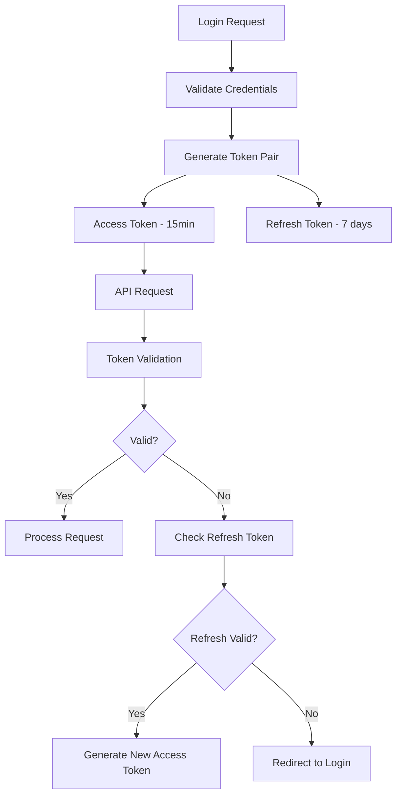
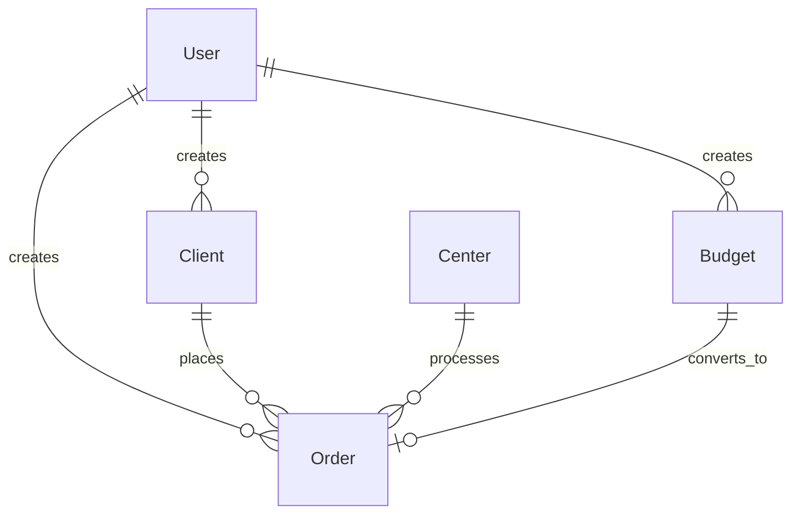

# Alphabook Web - Project Architecture Documentation

## System Overview

Alphabook Web is a modern Next.js 15 application for managing printing production workflows, featuring robust authentication, role-based access control, and comprehensive business logic for clients, orders, budgets, and production centers.

### Technology Stack
- **Frontend**: Next.js 15 with App Router, React 19, TypeScript
- **UI Framework**: shadcn/ui + Tailwind CSS
- **Database**: SQLite with Prisma ORM
- **Authentication**: JWT-based with refresh tokens
- **Authorization**: Role-based access control (RBAC)
- **Deployment**: Netlify with serverless functions

### Core Business Domains
1. **Client Management** - Customer data and relationship management
2. **Order Management** - Production order lifecycle
3. **Budget Management** - Pricing and approval workflows  
4. **Center Management** - Production facility management
5. **Reporting** - Financial and operational analytics

## Security Architecture

### Authentication System

#### JWT Token Flow


#### Implementation Files
- **JWT Management**: [`src/lib/auth.ts`](../src/lib/auth.ts) - Core JWT operations
- **Edge Authentication**: [`src/lib/edge-auth.ts`](../src/lib/edge-auth.ts) - Middleware token validation
- **API Authentication**: [`src/lib/api-auth.ts`](../src/lib/api-auth.ts) - Server-side user authentication
- **Server Authentication**: [`src/lib/server-auth.ts`](../src/lib/server-auth.ts) - Server component auth helper

#### Security Features
- ✅ **HttpOnly Cookies** - XSS-resistant token storage
- ✅ **Token Rotation** - Automatic refresh token rotation on use
- ✅ **Secure Headers** - Comprehensive security headers via middleware
- ✅ **CSRF Protection** - SameSite cookies and origin validation
- ✅ **Session Management** - Proper session lifecycle management

### Role-Based Access Control (RBAC)

#### Role Hierarchy
```
ADMIN (Level 3)
├── Full system access
├── User management
├── Financial data access
└── All MODERATOR permissions
    └── MODERATOR (Level 2)
        ├── Content moderation
        ├── Order approval
        ├── Report access
        └── All USER permissions
            └── USER (Level 1)
                ├── Own content management
                ├── Basic reporting
                └── Read-only access to shared data
```

#### Permission System
**Implementation**: [`src/lib/rbac.ts`](../src/lib/rbac.ts)

```typescript
enum Permission {
  READ_USERS, WRITE_USERS, DELETE_USERS,
  READ_CONTENT, WRITE_CONTENT, DELETE_CONTENT, MODERATE_CONTENT,
  READ_SYSTEM, WRITE_SYSTEM, DELETE_SYSTEM,
  READ_REPORTS, WRITE_REPORTS,
  READ_ORDERS, WRITE_ORDERS, APPROVE_ORDERS,
  READ_CENTERS, WRITE_CENTERS,
  READ_CLIENTS, WRITE_CLIENTS
}
```

#### API Route Protection Pattern
All API routes follow this security pattern:

```typescript
export async function GET(req: NextRequest) {
  try {
    // 1. Authentication (throws if not authenticated)
    const user = getAuthenticatedUser(req);
    
    // 2. Authorization (role-based access)
    if (user.role === Role.USER) {
      throw new ApiAuthError('Insufficient permissions', 403);
    }
    
    // 3. Resource filtering (based on user role)
    const select = getFieldSelection(user, 'resource_type');
    
    // 4. Data access with user context
    const data = await prisma.resource.findMany({
      where: applyUserFilter(user),
      select
    });
    
    return NextResponse.json({ data, error: null });
    
  } catch (error) {
    // 5. Standardized error handling
    const { error: apiError, status } = handleApiError(error);
    return NextResponse.json(apiError, { status });
  }
}
```

### Middleware Protection

**Implementation**: [`middleware.ts`](../middleware.ts)

#### Protected Routes
- **API Endpoints**: All `/api/*` routes except `/api/auth/*`
- **Application Pages**: All authenticated pages
- **Security Headers**: Applied to all responses

#### Security Headers Applied
```typescript
'X-Content-Type-Options': 'nosniff'
'X-Frame-Options': 'DENY'
'X-XSS-Protection': '1; mode=block'
'Referrer-Policy': 'strict-origin-when-cross-origin'
'Content-Security-Policy': Strict CSP rules
'Strict-Transport-Security': HTTPS enforcement (production)
```

## Database Architecture

### Schema Design
**Primary Schema**: [`prisma/schema.prisma`](../prisma/schema.prisma)

#### Core Models
- **User** - Authentication + authorization data
- **Client** - Customer information (CNPJ/CPF, contact details)
- **Order** - Production orders with financial data
- **Budget** - Pricing and specification details
- **Center** - Production facilities

#### Relationships


### Data Security
- **Field-Level Security**: Role-based field filtering via `getFieldSelection()`
- **Row-Level Security**: User context filtering via `applyUserFilter()`
- **Audit Trail**: Creation and modification tracking
- **PII Protection**: Proper handling of sensitive client data

## Component Architecture

### Layout System
**Root Layout**: [`src/app/layout.tsx`](../src/app/layout.tsx)

```typescript
RootLayout
├── ThemeProvider (light/dark mode)
└── RootLayoutClient
    ├── AuthProvider (authentication context)
    └── SidebarProvider + AppSidebar (navigation)
        └── page content
```

#### Navigation Structure
- **AppSidebar**: [`src/components/app-sidebar.tsx`](../src/components/app-sidebar.tsx)
  - Dashboard overview
  - Client management
  - Order management  
  - Budget management
  - Center management
  - Reports
  - User administration (admin only)

### Form Architecture

#### Form Components
- **BudgetForm**: [`src/components/forms/budget-form.tsx`](../src/components/forms/budget-form.tsx)
- **ClientForm**: [`src/components/forms/client-form.tsx`](../src/components/forms/client-form.tsx)  
- **OrderForm**: [`src/components/forms/order-form.tsx`](../src/components/forms/order-form.tsx)
- **CenterForm**: [`src/components/forms/center-form.tsx`](../src/components/forms/center-form.tsx)

#### Form Features
- ✅ **React Hook Form** - Validation and state management
- ✅ **Zod Validation** - Type-safe schema validation
- ✅ **Auto-calculation** - Price totals, specifications
- ✅ **Real-time Validation** - Immediate feedback
- ✅ **Error Handling** - Standardized error display
- ✅ **Success Feedback** - Toast notifications

### UI Component System

#### shadcn/ui Integration
**Configuration**: [`components.json`](../components.json)

#### Core UI Components
```
src/components/ui/
├── Core shadcn/ui components
│   ├── button.tsx, card.tsx, input.tsx
│   ├── table.tsx, dialog.tsx, select.tsx
│   └── sidebar.tsx, form.tsx, alert.tsx
├── Custom Business Components
│   ├── status-badge.tsx - Order/budget status display
│   ├── error-alert.tsx - Standardized error display
│   ├── empty-state.tsx - No-data state handling
│   └── form-grid.tsx - Responsive form layouts
```

#### Theme System
**Implementation**: [`src/app/globals.css`](../src/app/globals.css)
- CSS custom properties for theming
- Light/dark mode support
- Consistent color palette
- Responsive design utilities

## API Architecture

### Route Structure
```
src/app/api/
├── auth/
│   ├── login/ - User authentication
│   ├── logout/ - Session termination
│   ├── refresh/ - Token refresh
│   └── register/ - User registration
├── clients/
│   ├── route.ts - Client CRUD operations
│   ├── [id]/route.ts - Individual client operations
│   └── check-cnpj-cpf/ - Duplicate validation
├── orders/
│   ├── route.ts - Order CRUD operations
│   ├── [id]/route.ts - Individual order operations
│   └── editorials/ - Editorial data
├── budgets/
│   ├── route.ts - Budget CRUD operations
│   ├── [id]/route.ts - Individual budget operations
│   └── [id]/approve/ - Budget approval workflow
├── centers/
│   ├── route.ts - Center CRUD operations
│   └── [id]/route.ts - Individual center operations
├── dashboard/
│   ├── summary/ - Dashboard metrics
│   ├── recent-clients/ - Recent client data
│   └── recent-orders/ - Recent order data
├── reports/
│   ├── financial/ - Financial reporting
│   ├── production/ - Production reports
│   └── orders-summary/ - Order analytics
└── users/
    ├── route.ts - User management (admin only)
    └── [id]/route.ts - Individual user operations
```

### Request/Response Patterns

#### Standard API Response Format
```typescript
interface ApiResponse<T> {
  data: T | null;
  error: {
    message: string;
    details?: any;
  } | null;
}
```

#### Error Handling Pattern
```typescript
try {
  const user = getAuthenticatedUser(req);
  // ... business logic
  return NextResponse.json({ data: result, error: null });
} catch (error) {
  const { error: apiError, status } = handleApiError(error);
  return NextResponse.json(apiError, { status });
}
```

## State Management

### Client-Side State
- **React Hook Form** - Form state and validation
- **Local Component State** - UI state management
- **URL State** - Search, pagination, filters
- **Auth Context** - User session management

### Server-Side State
- **Database** - Persistent business data via Prisma
- **Session Store** - Authentication sessions
- **Validation Cache** - Form validation state

## Integration Points

### External Services
- **None currently** - Self-contained system

### API Integrations
- **None currently** - Internal APIs only

### Third-Party Libraries
```json
{
  "next": "15.0.3",
  "react": "19.0.0",
  "prisma": "Latest",
  "@radix-ui/*": "shadcn/ui component primitives",
  "react-hook-form": "Form management",
  "zod": "Schema validation",
  "tailwindcss": "Styling framework",
  "jsonwebtoken": "JWT token management",
  "bcryptjs": "Password hashing",
  "sonner": "Toast notifications"
}
```

## Deployment Structure

### Build Configuration
**Next.js Config**: [`next.config.ts`](../next.config.ts)
- ESLint enforcement
- Image optimization disabled for Netlify
- Prisma external package configuration

### Netlify Configuration
**Deployment Config**: [`netlify.toml`](../netlify.toml)
- Serverless function configuration
- Environment variable management
- Build optimization settings

### Environment Variables
```bash
# Database
DATABASE_URL="file:./dev.db"

# JWT Security
JWT_SECRET="<secure-secret>"
JWT_REFRESH_SECRET="<secure-refresh-secret>"

# Application
NEXT_PUBLIC_API_URL="http://localhost:3000"
```

## Error Handling Patterns

### Standardized Error Classes
```typescript
class ApiAuthError extends Error {
  constructor(message: string, status: number = 401) {
    super(message);
    this.status = status;
  }
}
```

### Error Response Format
```typescript
{
  error: {
    message: "User-friendly error message",
    details: null | ValidationDetails
  }
}
```

### Client-Side Error Handling
- **ErrorAlert Component** - Standardized error display
- **Toast Notifications** - User feedback
- **Form Validation** - Real-time validation feedback
- **Boundary Components** - Error boundary protection

## Security Standards

### Authentication Standards
1. **Strong JWT Secrets** - Minimum 32 characters
2. **Token Rotation** - Refresh tokens rotate on use
3. **HttpOnly Cookies** - XSS protection
4. **Secure Attributes** - HTTPS-only in production

### Authorization Standards
1. **Role-Based Access** - Three-tier role system
2. **Resource Ownership** - Users can only access owned resources
3. **Field-Level Security** - Role-based data filtering
4. **Principle of Least Privilege** - Minimal permissions by default

### Development Security
1. **Input Validation** - Zod schema validation
2. **SQL Injection Prevention** - Prisma parameterized queries
3. **XSS Prevention** - Sanitized data handling
4. **CSRF Protection** - SameSite cookies

## Coding Standards

### TypeScript Standards
```typescript
// Strict configuration enabled
{
  "strict": true,
  "noImplicitAny": true,
  "strictNullChecks": true
}

// Path aliases
{
  "@/*": "./src/*",
  "@/components/*": "./src/components/*",
  "@/lib/*": "./src/lib/*"
}
```

### Component Standards
```typescript
// Component naming: PascalCase
export function ClientForm({ mode, initialData }: ClientFormProps) {
  // ...
}

// Props interface: ComponentNameProps
interface ClientFormProps {
  mode: 'create' | 'edit';
  initialData?: Client;
}

// Use forwardRef for UI components
const Button = React.forwardRef<HTMLButtonElement, ButtonProps>(
  ({ className, ...props }, ref) => (
    <button ref={ref} className={cn(buttonVariants(), className)} {...props} />
  )
);
```

### File Organization Standards
```
src/
├── app/                    # Next.js App Router pages
│   ├── (routes)/
│   │   ├── page.tsx       # Page component (Server Component when possible)
│   │   └── layout.tsx     # Route-specific layout
│   └── api/               # API endpoints
├── components/            # React components
│   ├── ui/               # shadcn/ui components
│   ├── forms/            # Form components
│   ├── auth/             # Authentication components
│   └── layout/           # Layout components
├── lib/                  # Utilities and configurations
│   ├── auth.ts           # Authentication logic
│   ├── rbac.ts           # Authorization logic
│   ├── prisma.ts         # Database configuration
│   └── utils.ts          # Shared utilities
├── types/                # TypeScript type definitions
│   ├── models.ts         # Data models
│   └── api.ts            # API response types
└── hooks/                # Custom React hooks
```

## API Documentation

### Authentication Endpoints
- **POST** `/api/auth/login` - User login
- **POST** `/api/auth/logout` - User logout
- **POST** `/api/auth/refresh` - Token refresh
- **POST** `/api/auth/register` - User registration
- **GET** `/api/auth/validate` - Token validation

### Business Endpoints

#### Clients
- **GET** `/api/clients` - List clients (role-filtered)
- **POST** `/api/clients` - Create client (MODERATOR+)
- **GET** `/api/clients/[id]` - Get client (ownership-filtered)
- **PUT** `/api/clients/[id]` - Update client (MODERATOR+)
- **DELETE** `/api/clients/[id]` - Delete client (ADMIN only)

#### Orders
- **GET** `/api/orders` - List orders (role-filtered)
- **POST** `/api/orders` - Create order (USER+)
- **GET** `/api/orders/[id]` - Get order (ownership-filtered)
- **PUT** `/api/orders/[id]` - Update order (MODERATOR+)
- **DELETE** `/api/orders/[id]` - Delete order (ADMIN only)

## Troubleshooting Guidelines

### Common Issues

#### Authentication Failures
1. **Check token expiry** - Access tokens expire after 15 minutes
2. **Verify middleware configuration** - Ensure route patterns match
3. **Validate JWT secret** - Must be set and >= 32 characters
4. **Check cookie settings** - HttpOnly, Secure, SameSite configuration

#### Authorization Errors
1. **Role verification** - Check user role in database
2. **Permission mapping** - Verify RBAC configuration
3. **Resource ownership** - Ensure proper user context filtering
4. **Field filtering** - Check `getFieldSelection()` logic

#### Form Validation Issues
1. **Schema validation** - Check Zod schema definitions
2. **Type compatibility** - Verify form types match API types
3. **Default values** - Ensure proper data mapping
4. **Error display** - Check error message formatting

### Debugging Tools
- **JWT Debugger** - jwt.io for token inspection
- **Database Browser** - Prisma Studio for data inspection
- **API Testing** - cURL commands for endpoint testing
- **Dev Tools** - React DevTools for component inspection

## Performance Considerations

### Optimization Strategies
1. **Server Components** - Default to server-side rendering
2. **Client Components** - Only when interactivity required
3. **Code Splitting** - Dynamic imports for heavy components
4. **Image Optimization** - Next.js image optimization
5. **Bundle Analysis** - Monitor bundle size growth

### Caching Strategy
1. **Database Queries** - Efficient Prisma query patterns
2. **API Responses** - Appropriate cache headers
3. **Static Assets** - CDN caching via Netlify
4. **Client-Side** - SWR for data fetching optimization

## Development Workflow

### Git Workflow
```bash
# Feature development
git checkout -b feature/feature-name
git commit -m "feat(scope): description"

# Bug fixes  
git checkout -b fix/bug-description
git commit -m "fix(scope): description"

# Security fixes
git checkout -b security/vulnerability-fix
git commit -m "security(scope): description"
```

### Code Quality Standards
1. **TypeScript** - Zero tolerance for `any` types
2. **ESLint** - Strict linting rules enforced
3. **Testing** - Unit tests for critical business logic
4. **Security** - Regular security audits

### Naming Conventions
- **Files**: kebab-case (`client-form.tsx`)
- **Components**: PascalCase (`ClientForm`)
- **Functions**: camelCase (`getAuthenticatedUser`)
- **Constants**: UPPER_SNAKE_CASE (`ROLE_PERMISSIONS`)
- **Types**: PascalCase (`ClientFormProps`)

## Maintenance Protocols

### Documentation Maintenance
1. **Version Control** - Documentation versioned with code
2. **Review Cycle** - Monthly architecture review
3. **Update Triggers** - Update docs with any architecture changes
4. **Accuracy Validation** - Regular code vs docs alignment checks

### Security Maintenance
1. **Dependency Updates** - Weekly security patch reviews
2. **Token Rotation** - Manual key rotation capability
3. **Access Reviews** - Quarterly user access audits
4. **Vulnerability Scanning** - Automated security scans

### Architecture Evolution
1. **ADR Documentation** - Architecture Decision Records
2. **Migration Guides** - Breaking change documentation  
3. **Backward Compatibility** - Maintain stable APIs
4. **Performance Monitoring** - Regular performance audits

---

**Document Version**: 1.0  
**Last Updated**: 2025-10-03  
**Review Schedule**: Monthly  
**Architecture Version**: Current  
**Status**: ✅ Production Ready

---

## Architectural Decision Records (ADRs)

### ADR-001: JWT vs Session-Based Authentication
**Decision**: JWT tokens with refresh rotation  
**Rationale**: Stateless authentication, mobile support, scalability  
**Date**: 2025-09-30

### ADR-002: Role-Based vs Permission-Based Authorization  
**Decision**: Hybrid approach - roles with granular permissions  
**Rationale**: Business role alignment + flexibility  
**Date**: 2025-09-30

### ADR-003: Server Components vs Client Components
**Decision**: Server Components by default, Client when interactivity needed  
**Rationale**: Performance, SEO, reduced bundle size  
**Date**: 2025-10-01

### ADR-004: Database Choice - SQLite vs PostgreSQL
**Decision**: SQLite for development, PostgreSQL for production  
**Rationale**: Development simplicity, production robustness  
**Date**: 2025-09-26