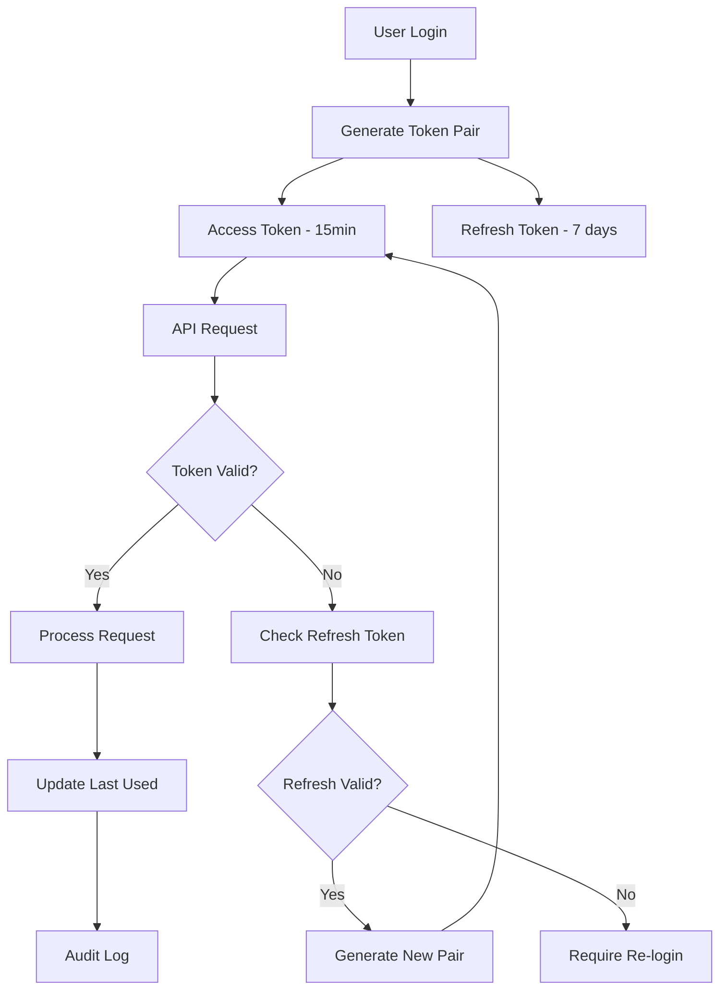

# Secure Token Management Strategy

## Current Token Security Issues

### Critical Vulnerabilities
1. **Non-HttpOnly Access Tokens** - XSS vulnerability
2. **No Token Rotation** - Long-lived token exposure risk
3. **Weak Secret Management** - Fallback to hardcoded secrets
4. **No Token Revocation** - Cannot invalidate compromised tokens
5. **Missing Token Binding** - No device/session correlation

## Secure Token Architecture

### Token Types & Lifecycle



### 1. Access Token Security

#### Structure
```typescript
interface AccessTokenPayload {
  // Standard claims
  iss: string;          // Issuer
  sub: string;          // Subject (userId)
  aud: string;          // Audience
  exp: number;          // Expiration (15 minutes)
  iat: number;          // Issued at
  jti: string;          // JWT ID (unique token identifier)
  
  // Custom claims
  userId: number;       // User ID
  email: string;        // User email
  role: Role;          // User role
  sessionId: string;   // Session identifier
  tokenVersion: number; // For token revocation
  permissions: string[]; // Cached permissions
  
  // Security claims
  deviceId?: string;   // Device fingerprint
  ipAddress?: string;  // Original IP (optional)
}
```

#### Generation Strategy
```typescript
class SecureTokenManager {
  async generateAccessToken(user: User, session: Session): Promise<string> {
    const tokenId = crypto.randomUUID();
    
    const payload: AccessTokenPayload = {
      iss: process.env.JWT_ISSUER || 'alphabook-api',
      sub: user.id.toString(),
      aud: process.env.JWT_AUDIENCE || 'alphabook-client',
      exp: Math.floor(Date.now() / 1000) + (15 * 60), // 15 minutes
      iat: Math.floor(Date.now() / 1000),
      jti: tokenId,
      
      userId: user.id,
      email: user.email,
      role: user.role,
      sessionId: session.id,
      tokenVersion: user.tokenVersion || 1,
      permissions: await this.getUserPermissions(user.role),
      
      deviceId: session.deviceFingerprint,
    };
    
    const token = jwt.sign(payload, this.getSigningKey(), {
      algorithm: 'HS256',
      keyid: this.getCurrentKeyId()
    });
    
    // Store token metadata for revocation
    await this.storeTokenMetadata(tokenId, {
      userId: user.id,
      sessionId: session.id,
      createdAt: new Date(),
      expiresAt: new Date(Date.now() + 15 * 60 * 1000)
    });
    
    return token;
  }
  
  private getSigningKey(): string {
    const keyId = this.getCurrentKeyId();
    return process.env[`JWT_SECRET_${keyId}`] || process.env.JWT_SECRET!;
  }
  
  private getCurrentKeyId(): string {
    // Key rotation support
    return process.env.JWT_KEY_ID || '1';
  }
}
```

### 2. Refresh Token Security

#### Structure & Storage
```typescript
interface RefreshTokenPayload {
  sub: string;          // User ID
  jti: string;          // Token ID
  exp: number;          // 7 days
  iat: number;
  sessionId: string;
  tokenFamily: string;  // For rotation detection
}

class RefreshTokenManager {
  async generateRefreshToken(userId: number, sessionId: string): Promise<string> {
    const tokenId = crypto.randomUUID();
    const tokenFamily = crypto.randomUUID();
    
    const payload: RefreshTokenPayload = {
      sub: userId.toString(),
      jti: tokenId,
      exp: Math.floor(Date.now() / 1000) + (7 * 24 * 60 * 60), // 7 days
      iat: Math.floor(Date.now() / 1000),
      sessionId,
      tokenFamily
    };
    
    const token = jwt.sign(payload, process.env.JWT_REFRESH_SECRET!, {
      algorithm: 'HS256'
    });
    
    // Store in database with family tracking
    await prisma.refreshToken.create({
      data: {
        id: tokenId,
        userId,
        sessionId,
        tokenFamily,
        token: await this.hashToken(token),
        expiresAt: new Date(Date.now() + 7 * 24 * 60 * 60 * 1000),
        isActive: true
      }
    });
    
    return token;
  }
  
  async rotateRefreshToken(oldToken: string): Promise<{ accessToken: string; refreshToken: string }> {
    const decoded = this.verifyRefreshToken(oldToken);
    if (!decoded) throw new Error('Invalid refresh token');
    
    // Check for token reuse (security breach detection)
    const storedToken = await prisma.refreshToken.findUnique({
      where: { id: decoded.jti },
      include: { session: { include: { user: true } } }
    });
    
    if (!storedToken || !storedToken.isActive) {
      // Possible token theft - revoke entire token family
      await this.revokeTokenFamily(decoded.tokenFamily);
      throw new Error('Refresh token reuse detected - security breach');
    }
    
    // Mark old token as used
    await prisma.refreshToken.update({
      where: { id: decoded.jti },
      data: { isActive: false, usedAt: new Date() }
    });
    
    // Generate new token pair
    const user = storedToken.session.user;
    const session = storedToken.session;
    
    const newAccessToken = await this.tokenManager.generateAccessToken(user, session);
    const newRefreshToken = await this.generateRefreshToken(user.id, session.id);
    
    return {
      accessToken: newAccessToken,
      refreshToken: newRefreshToken
    };
  }
  
  private async revokeTokenFamily(tokenFamily: string): Promise<void> {
    await prisma.refreshToken.updateMany({
      where: { tokenFamily, isActive: true },
      data: { isActive: false, revokedAt: new Date() }
    });
  }
}
```

### 3. Secure Cookie Configuration

#### HttpOnly Refresh Tokens
```typescript
export function setSecureRefreshTokenCookie(
  response: NextResponse, 
  refreshToken: string
): void {
  response.cookies.set('refreshToken', refreshToken, {
    httpOnly: true,           // ✅ Prevent XSS access
    secure: true,             // ✅ HTTPS only
    sameSite: 'strict',       // ✅ CSRF protection
    maxAge: 7 * 24 * 60 * 60, // 7 days
    path: '/api/auth',        // ✅ Limit scope
    domain: process.env.COOKIE_DOMAIN
  });
}
```

#### Memory-Based Access Token Storage
```typescript
// Client-side token management
class ClientTokenManager {
  private accessToken: string | null = null;
  private tokenExpiry: number | null = null;
  
  setAccessToken(token: string): void {
    const payload = this.decodeToken(token);
    this.accessToken = token;
    this.tokenExpiry = payload.exp * 1000;
  }
  
  getAccessToken(): string | null {
    if (!this.accessToken || !this.tokenExpiry) return null;
    
    // Check if token expires in next 60 seconds
    if (Date.now() + 60000 >= this.tokenExpiry) {
      this.clearToken();
      return null;
    }
    
    return this.accessToken;
  }
  
  clearToken(): void {
    this.accessToken = null;
    this.tokenExpiry = null;
  }
  
  private decodeToken(token: string): any {
    try {
      return JSON.parse(atob(token.split('.')[1]));
    } catch {
      return {};
    }
  }
}
```

### 4. Token Validation & Security

#### Multi-Layer Validation
```typescript
interface TokenValidationResult {
  valid: boolean;
  payload?: AccessTokenPayload;
  error?: string;
  needsRefresh?: boolean;
}

class TokenValidator {
  async validateAccessToken(token: string, request: Request): Promise<TokenValidationResult> {
    try {
      // 1. JWT signature validation
      const payload = jwt.verify(token, this.getSigningKey()) as AccessTokenPayload;
      
      // 2. Check token metadata exists
      const metadata = await this.getTokenMetadata(payload.jti);
      if (!metadata) {
        return { valid: false, error: 'Token revoked' };
      }
      
      // 3. Validate session is active
      const session = await prisma.session.findUnique({
        where: { id: payload.sessionId, isActive: true }
      });
      
      if (!session) {
        return { valid: false, error: 'Session expired' };
      }
      
      // 4. Check token version (for user-wide revocation)
      const user = await prisma.user.findUnique({
        where: { id: payload.userId },
        select: { tokenVersion: true }
      });
      
      if (user?.tokenVersion !== payload.tokenVersion) {
        return { valid: false, error: 'Token version mismatch' };
      }
      
      // 5. Device fingerprint validation (optional)
      if (payload.deviceId && process.env.ENABLE_DEVICE_BINDING === 'true') {
        const currentFingerprint = this.generateDeviceFingerprint(request);
        if (payload.deviceId !== currentFingerprint) {
          await this.logSecurityEvent('device_mismatch', payload.userId);
          return { valid: false, error: 'Device mismatch' };
        }
      }
      
      // 6. Check if token expires soon
      const expiresAt = payload.exp * 1000;
      const needsRefresh = (expiresAt - Date.now()) < 5 * 60 * 1000; // 5 minutes
      
      return {
        valid: true,
        payload,
        needsRefresh
      };
      
    } catch (error) {
      if (error instanceof jwt.TokenExpiredError) {
        return { valid: false, error: 'Token expired', needsRefresh: true };
      }
      
      return { valid: false, error: 'Invalid token' };
    }
  }
  
  private generateDeviceFingerprint(request: Request): string {
    const headers = {
      userAgent: request.headers.get('user-agent') || '',
      acceptLanguage: request.headers.get('accept-language') || '',
      acceptEncoding: request.headers.get('accept-encoding') || ''
    };
    
    return crypto
      .createHash('sha256')
      .update(JSON.stringify(headers))
      .digest('hex');
  }
}
```

### 5. Key Rotation Strategy

#### Automated Key Rotation
```typescript
class KeyRotationManager {
  private readonly ROTATION_INTERVAL = 90 * 24 * 60 * 60 * 1000; // 90 days
  
  async rotateSigningKeys(): Promise<void> {
    const currentKeyId = process.env.JWT_KEY_ID || '1';
    const nextKeyId = (parseInt(currentKeyId) + 1).toString();
    
    // Generate new key
    const newKey = crypto.randomBytes(64).toString('hex');
    
    // Store new key securely
    await this.storeKey(nextKeyId, newKey);
    
    // Update active key ID
    await this.updateActiveKeyId(nextKeyId);
    
    // Schedule cleanup of old key (after grace period)
    setTimeout(() => {
      this.cleanupOldKey(currentKeyId);
    }, 24 * 60 * 60 * 1000); // 24 hour grace period
  }
  
  async getValidationKeys(): Promise<Record<string, string>> {
    // Return current and previous keys for validation
    const currentKeyId = process.env.JWT_KEY_ID || '1';
    const previousKeyId = (parseInt(currentKeyId) - 1).toString();
    
    return {
      [currentKeyId]: await this.getKey(currentKeyId),
      [previousKeyId]: await this.getKey(previousKeyId)
    };
  }
}
```

### 6. Token Security Monitoring

#### Suspicious Activity Detection
```typescript
interface SecurityEvent {
  type: 'token_reuse' | 'device_mismatch' | 'unusual_activity' | 'brute_force';
  userId: number;
  severity: 'low' | 'medium' | 'high' | 'critical';
  metadata: Record<string, any>;
  timestamp: Date;
}

class TokenSecurityMonitor {
  async detectTokenReuse(refreshToken: string): Promise<boolean> {
    const decoded = this.decodeRefreshToken(refreshToken);
    if (!decoded) return false;
    
    const recentUsage = await prisma.refreshTokenUsage.findMany({
      where: {
        tokenId: decoded.jti,
        createdAt: {
          gte: new Date(Date.now() - 60000) // Last minute
        }
      }
    });
    
    if (recentUsage.length > 1) {
      await this.createSecurityEvent({
        type: 'token_reuse',
        userId: parseInt(decoded.sub),
        severity: 'critical',
        metadata: { tokenId: decoded.jti, usageCount: recentUsage.length },
        timestamp: new Date()
      });
      return true;
    }
    
    return false;
  }
  
  async detectUnusualActivity(userId: number, request: Request): Promise<boolean> {
    const recentSessions = await prisma.session.findMany({
      where: {
        userId,
        createdAt: {
          gte: new Date(Date.now() - 24 * 60 * 60 * 1000) // Last 24 hours
        }
      }
    });
    
    const locations = recentSessions.map(s => this.getLocationFromIP(s.ipAddress));
    const uniqueLocations = new Set(locations);
    
    // Alert if more than 3 different locations in 24 hours
    if (uniqueLocations.size > 3) {
      await this.createSecurityEvent({
        type: 'unusual_activity',
        userId,
        severity: 'medium',
        metadata: { locations: Array.from(uniqueLocations) },
        timestamp: new Date()
      });
      return true;
    }
    
    return false;
  }
}
```

### 7. Emergency Token Revocation

#### Global Revocation System
```typescript
class EmergencyRevocationManager {
  // Revoke all tokens for a user
  async revokeAllUserTokens(userId: number, reason: string): Promise<void> {
    // Increment token version (invalidates all JWTs)
    await prisma.user.update({
      where: { id: userId },
      data: { tokenVersion: { increment: 1 } }
    });
    
    // Deactivate all refresh tokens
    await prisma.refreshToken.updateMany({
      where: { userId, isActive: true },
      data: { 
        isActive: false, 
        revokedAt: new Date(),
        revocationReason: reason
      }
    });
    
    // Deactivate all sessions
    await prisma.session.updateMany({
      where: { userId, isActive: true },
      data: { 
        isActive: false,
        endedAt: new Date(),
        endReason: reason
      }
    });
    
    // Clear token metadata
    await this.clearUserTokenMetadata(userId);
  }
  
  // Revoke specific session
  async revokeSession(sessionId: string, reason: string): Promise<void> {
    const session = await prisma.session.findUnique({
      where: { id: sessionId },
      include: { refreshTokens: true }
    });
    
    if (!session) return;
    
    // Deactivate session
    await prisma.session.update({
      where: { id: sessionId },
      data: { 
        isActive: false,
        endedAt: new Date(),
        endReason: reason
      }
    });
    
    // Revoke associated refresh tokens
    await prisma.refreshToken.updateMany({
      where: { sessionId, isActive: true },
      data: { 
        isActive: false,
        revokedAt: new Date(),
        revocationReason: reason
      }
    });
  }
  
  // Global emergency shutdown
  async emergencyShutdown(reason: string): Promise<void> {
    // This would be used in case of critical security breach
    
    // Mark all tokens as potentially compromised
    await prisma.securityIncident.create({
      data: {
        type: 'GLOBAL_REVOCATION',
        severity: 'CRITICAL',
        reason,
        timestamp: new Date(),
        affectedUsers: await prisma.user.count()
      }
    });
    
    // Force all users to re-authenticate
    await prisma.user.updateMany({
      data: { tokenVersion: { increment: 1 } }
    });
    
    // Deactivate all sessions and tokens
    await prisma.session.updateMany({
      where: { isActive: true },
      data: { 
        isActive: false,
        endedAt: new Date(),
        endReason: `EMERGENCY_SHUTDOWN: ${reason}`
      }
    });
  }
}
```

## Implementation Checklist

### Phase 1: Immediate Security (24 hours)
- [ ] Implement HttpOnly refresh token cookies
- [ ] Add token metadata storage
- [ ] Implement basic token validation
- [ ] Add token revocation endpoints

### Phase 2: Enhanced Security (48 hours)
- [ ] Implement refresh token rotation
- [ ] Add device fingerprinting
- [ ] Implement token family tracking
- [ ] Add security event logging

### Phase 3: Advanced Security (1 week)
- [ ] Implement key rotation system
- [ ] Add suspicious activity detection
- [ ] Implement emergency revocation
- [ ] Add comprehensive monitoring

### Phase 4: Production Hardening (2 weeks)
- [ ] Performance optimization
- [ ] Load testing
- [ ] Security penetration testing
- [ ] Documentation and training

---

**Security Level:** Military-grade  
**Token Lifetime:** Access: 15min, Refresh: 7 days  
**Rotation:** Automatic on refresh  
**Revocation:** Instant global capability  
**Monitoring:** Real-time threat detection