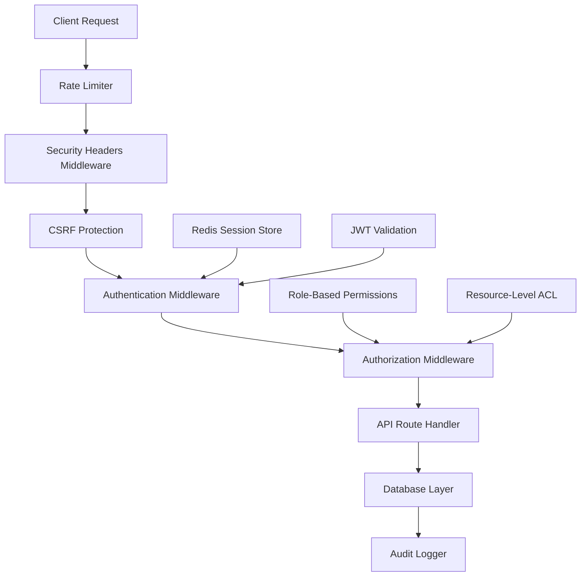

# Zero-Trust Authentication Architecture Design

## Architecture Overview

### Core Principles
1. **Never Trust, Always Verify** - Every request validated
2. **Least Privilege Access** - Minimal permissions by default
3. **Defense in Depth** - Multiple security layers
4. **Secure by Design** - Security built into every component

## System Architecture



## Security Layers

### Layer 1: Network Security
- **Rate Limiting:** IP-based and user-based limits
- **DDoS Protection:** Request throttling and blocking
- **Security Headers:** HSTS, CSP, X-Frame-Options
- **CORS Configuration:** Strict origin policies

### Layer 2: Request Validation
- **Input Sanitization:** XSS prevention
- **CSRF Protection:** Token validation on mutations
- **Content-Type Validation:** Prevent content confusion
- **Request Size Limits:** Prevent resource exhaustion

### Layer 3: Authentication
- **JWT Token Validation:** Signature and expiration checks
- **Session Management:** Server-side session tracking
- **Multi-Factor Authentication:** Optional 2FA support
- **Device Fingerprinting:** Suspicious login detection

### Layer 4: Authorization
- **Role-Based Access Control:** Hierarchical permissions
- **Resource-Level Permissions:** Fine-grained access
- **Dynamic Authorization:** Context-aware decisions
- **Privilege Escalation Prevention:** Strict role validation

### Layer 5: Data Protection
- **Field-Level Encryption:** Sensitive data protection
- **Data Masking:** PII protection in logs
- **Audit Logging:** Comprehensive access tracking
- **Data Loss Prevention:** Sensitive data monitoring

## Component Specifications

### 1. Enhanced Middleware Stack

```typescript
// middleware.ts - New Architecture
import { NextRequest, NextResponse } from 'next/server';
import { 
  rateLimitMiddleware,
  securityHeadersMiddleware,
  csrfProtectionMiddleware,
  authenticationMiddleware,
  authorizationMiddleware,
  auditLoggingMiddleware
} from './lib/middleware';

export async function middleware(request: NextRequest) {
  const response = NextResponse.next();
  
  // Layer 1: Rate Limiting
  const rateLimitResult = await rateLimitMiddleware(request);
  if (rateLimitResult.blocked) {
    return NextResponse.json({ error: 'Rate limit exceeded' }, { status: 429 });
  }
  
  // Layer 2: Security Headers
  securityHeadersMiddleware(response);
  
  // Layer 3: CSRF Protection (for mutations)
  if (['POST', 'PUT', 'PATCH', 'DELETE'].includes(request.method)) {
    const csrfResult = await csrfProtectionMiddleware(request);
    if (!csrfResult.valid) {
      return NextResponse.json({ error: 'CSRF token invalid' }, { status: 403 });
    }
  }
  
  // Layer 4: Authentication
  const authResult = await authenticationMiddleware(request);
  if (!authResult.authenticated) {
    return NextResponse.redirect(new URL('/login', request.url));
  }
  
  // Layer 5: Authorization
  const authzResult = await authorizationMiddleware(request, authResult.user);
  if (!authzResult.authorized) {
    return NextResponse.json({ error: 'Insufficient permissions' }, { status: 403 });
  }
  
  // Layer 6: Audit Logging
  await auditLoggingMiddleware(request, authResult.user);
  
  return response;
}

export const config = {
  matcher: [
    // Protect ALL API routes
    '/api/dashboard/:path*',
    '/api/clients/:path*',
    '/api/orders/:path*',
    '/api/budgets/:path*',
    '/api/centers/:path*',
    '/api/reports/:path*',
    '/api/users/:path*',
    // Protect ALL application pages
    '/dashboard/:path*',
    '/clients/:path*',
    '/orders/:path*',
    '/budgets/:path*',
    '/centers/:path*',
    '/reports/:path*',
    '/admin/:path*'
  ],
};
```

### 2. Secure Token Management

```typescript
// lib/secure-token.ts
interface SecureTokenConfig {
  accessTokenTTL: number;     // 15 minutes
  refreshTokenTTL: number;    // 7 days
  maxRefreshCount: number;    // 10 refreshes before re-auth
  tokenRotation: boolean;     // Rotate on each refresh
}

interface TokenPair {
  accessToken: string;
  refreshToken: string;
  expiresAt: Date;
  refreshCount: number;
}

class SecureTokenManager {
  async generateTokenPair(user: User): Promise<TokenPair> {
    const tokenId = crypto.randomUUID();
    const sessionId = crypto.randomUUID();
    
    const accessToken = await this.signJWT({
      userId: user.id,
      email: user.email,
      role: user.role,
      tokenId,
      sessionId,
      type: 'access'
    }, { expiresIn: '15m' });
    
    const refreshToken = await this.signJWT({
      userId: user.id,
      tokenId,
      sessionId,
      type: 'refresh'
    }, { expiresIn: '7d' });
    
    // Store session in Redis
    await this.storeSession(sessionId, {
      userId: user.id,
      tokenId,
      refreshCount: 0,
      createdAt: new Date(),
      lastUsedAt: new Date(),
      deviceFingerprint: this.getDeviceFingerprint(request)
    });
    
    return {
      accessToken,
      refreshToken,
      expiresAt: new Date(Date.now() + 15 * 60 * 1000),
      refreshCount: 0
    };
  }
}
```

### 3. Database Session Management

```typescript
// lib/session-store.ts
interface SessionData {
  userId: number;
  tokenId: string;
  refreshCount: number;
  createdAt: Date;
  lastUsedAt: Date;
  deviceFingerprint: string;
  ipAddress: string;
  userAgent: string;
}

class DatabaseSessionStore {
  async createSession(sessionId: string, data: SessionData): Promise<void> {
    await prisma.session.create({
      data: {
        id: sessionId,
        userId: data.userId,
        tokenId: data.tokenId,
        refreshCount: data.refreshCount,
        createdAt: data.createdAt,
        lastUsedAt: data.lastUsedAt,
        deviceFingerprint: data.deviceFingerprint,
        ipAddress: data.ipAddress,
        userAgent: data.userAgent,
        isActive: true
      }
    });
  }
  
  async validateSession(sessionId: string): Promise<SessionData | null> {
    const session = await prisma.session.findUnique({
      where: { id: sessionId, isActive: true },
      include: { user: true }
    });
    
    if (!session) return null;
    
    // Check for session expiration (7 days)
    if (Date.now() - session.createdAt.getTime() > 7 * 24 * 60 * 60 * 1000) {
      await this.revokeSession(sessionId);
      return null;
    }
    
    // Update last used timestamp
    await prisma.session.update({
      where: { id: sessionId },
      data: { lastUsedAt: new Date() }
    });
    
    return session;
  }
}
```

## Security Features

### 1. Multi-Factor Authentication (Optional)
```typescript
interface MFAConfig {
  enabled: boolean;
  methods: ['totp', 'sms', 'email'];
  gracePeriod: number; // Days before MFA required
}
```

### 2. Device Fingerprinting
```typescript
function generateDeviceFingerprint(request: Request): string {
  const headers = {
    userAgent: request.headers.get('user-agent'),
    acceptLanguage: request.headers.get('accept-language'),
    acceptEncoding: request.headers.get('accept-encoding')
  };
  
  return crypto
    .createHash('sha256')
    .update(JSON.stringify(headers))
    .digest('hex');
}
```

### 3. Suspicious Activity Detection
```typescript
interface SecurityAlert {
  userId: number;
  alertType: 'unusual_login' | 'failed_attempts' | 'token_reuse';
  severity: 'low' | 'medium' | 'high';
  timestamp: Date;
  metadata: Record<string, any>;
}

class SecurityMonitor {
  async detectSuspiciousLogin(userId: number, request: Request): Promise<boolean> {
    const recentSessions = await this.getRecentSessions(userId, '1h');
    const newLocation = this.getLocationFromIP(request.ip);
    
    // Check for impossible travel
    if (recentSessions.some(session => 
      this.isImpossibleTravel(session.location, newLocation, session.timestamp)
    )) {
      await this.createAlert(userId, 'unusual_login', 'high', {
        newLocation,
        previousSessions: recentSessions
      });
      return true;
    }
    
    return false;
  }
}
```

## API Protection Patterns

### 1. Route-Level Authorization
```typescript
// app/api/clients/route.ts
export async function GET(request: NextRequest) {
  // Authentication handled by middleware
  const user = request.user; // Set by auth middleware
  
  // Authorization check
  if (!hasPermission(user.role, 'read:clients')) {
    return NextResponse.json({ error: 'Forbidden' }, { status: 403 });
  }
  
  // Additional resource-level checks
  const clientFilter = getClientFilter(user.role, user.id);
  
  const clients = await prisma.client.findMany({
    where: clientFilter
  });
  
  return NextResponse.json(clients);
}
```

### 2. Field-Level Security
```typescript
function sanitizeClientData(client: Client, userRole: Role): Partial<Client> {
  const publicFields = ['id', 'name', 'email'];
  const moderatorFields = [...publicFields, 'cnpjCpf', 'phone'];
  const adminFields = [...moderatorFields, 'internalNotes', 'creditLimit'];
  
  switch (userRole) {
    case Role.USER: return pick(client, publicFields);
    case Role.MODERATOR: return pick(client, moderatorFields);
    case Role.ADMIN: return client;
    default: return pick(client, publicFields);
  }
}
```

## Performance Optimizations

### 1. Token Caching Strategy
- **Redis Cache:** Store validated tokens for 5 minutes
- **Memory Cache:** Session data for active requests
- **Database Optimization:** Indexed session queries

### 2. Lazy Authorization
- **Route-Level:** Basic role checks in middleware
- **Resource-Level:** Detailed permissions on data access
- **Field-Level:** Dynamic data filtering

### 3. Connection Pooling
- **Database:** Optimized Prisma connection pool
- **Redis:** Connection reuse for session storage
- **HTTP:** Keep-alive connections for external services

## Security Monitoring

### 1. Real-Time Alerts
- Failed authentication attempts
- Unusual login patterns
- Privilege escalation attempts
- Data access anomalies

### 2. Audit Logging
- All authentication events
- Authorization decisions
- Data access patterns
- Administrative actions

### 3. Security Metrics
- Authentication success/failure rates
- Token refresh patterns
- Session duration statistics
- Permission usage analytics

---

**Architecture Version:** 2.0  
**Security Level:** Zero-Trust  
**Compliance:** LGPD, GDPR Ready  
**Performance Target:** < 100ms auth overhead